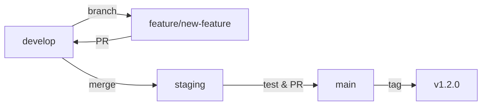
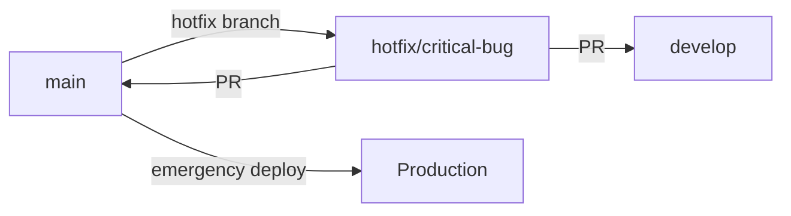
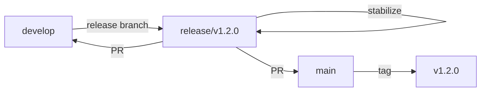

# SafeWork Git 브랜치 전략 및 워크플로우

## 🌿 브랜치 구조

### Main Branches (영구 브랜치)

#### 🚀 `main` (Production)
- **목적**: 프로덕션 배포용 안정화된 코드
- **보호 수준**: 최고 (Direct Push 금지)
- **배포**: 자동 프로덕션 배포
- **릴리즈**: 정식 릴리즈 생성
- **버전**: `1.YYYYMMDD.HHMM` 형식

#### 🧪 `staging` (Staging Environment) 
- **목적**: 프로덕션 배포 전 최종 테스트
- **보호 수준**: 높음 (PR 승인 필요)
- **배포**: 스테이징 환경 자동 배포
- **릴리즈**: Pre-release 생성
- **버전**: `staging-1.YYYYMMDD.HHMM-staging`

#### 🔧 `develop` (Development Integration)
- **목적**: 개발 기능 통합 및 테스트
- **보호 수준**: 중간 (테스트 통과 필요)
- **배포**: 개발 환경 자동 배포
- **릴리즈**: Pre-release 생성
- **버전**: `dev-1.YYYYMMDD.HHMM-development`

### Supporting Branches (임시 브랜치)

#### 🌟 `feature/*` (기능 개발)
- **명명 규칙**: `feature/기능명` 또는 `feature/이슈번호-기능명`
- **생성 기준**: `develop` 브랜치에서 분기
- **병합 대상**: `develop` 브랜치로 PR
- **배포**: 없음 (테스트만 실행)
- **수명**: 기능 완료 후 삭제

#### 🐛 `hotfix/*` (긴급 수정)
- **명명 규칙**: `hotfix/수정내용` 또는 `hotfix/버그번호-수정내용`
- **생성 기준**: `main` 브랜치에서 분기
- **병합 대상**: `main`과 `develop` 모두
- **배포**: 긴급 배포 가능
- **수명**: 수정 완료 후 삭제

#### 🔄 `release/*` (릴리즈 준비)
- **명명 규칙**: `release/v1.2.0`
- **생성 기준**: `develop` 브랜치에서 분기
- **병합 대상**: `main`과 `develop` 모두
- **배포**: 릴리즈 후보 테스트
- **수명**: 릴리즈 완료 후 삭제

## 🔄 워크플로우

### 1. 일반 기능 개발 흐름



1. `develop`에서 `feature/새기능` 브랜치 생성
2. 기능 개발 및 로컬 테스트
3. `feature/새기능` → `develop` PR 생성
4. 자동 테스트 실행 및 코드 리뷰
5. PR 승인 후 `develop`에 병합
6. `develop` → `staging` 자동 병합 또는 수동 PR
7. 스테이징 환경에서 통합 테스트
8. `staging` → `main` PR 생성
9. 최종 승인 후 `main`에 병합
10. 프로덕션 자동 배포 및 릴리즈 생성

### 2. 핫픽스 워크플로우



1. `main`에서 `hotfix/버그명` 브랜치 생성
2. 긴급 수정 작업
3. `hotfix/버그명` → `main` PR 생성 (긴급 승인)
4. `hotfix/버그명` → `develop` PR 생성 (동기화)
5. 긴급 배포 실행

### 3. 릴리즈 워크플로우



1. `develop`에서 `release/v1.2.0` 브랜치 생성
2. 릴리즈 준비 (버전 업데이트, 문서화 등)
3. 릴리즈 후보 테스트
4. `release/v1.2.0` → `main` PR 생성
5. `release/v1.2.0` → `develop` PR 생성 (변경사항 동기화)
6. 릴리즈 배포 및 태그 생성

## 🛡️ 브랜치 보호 규칙

### Main 브랜치 보호
- ✅ **Require pull request reviews**: 1명 이상 승인 필요
- ✅ **Require status checks**: 모든 테스트 통과 필요
- ✅ **Require branches to be up to date**: 최신 상태 유지 필요
- ✅ **Require linear history**: 선형 히스토리 유지
- ✅ **Include administrators**: 관리자도 규칙 적용
- 🚫 **Allow force pushes**: 금지
- 🚫 **Allow deletions**: 금지

### Staging 브랜치 보호
- ✅ **Require pull request reviews**: 1명 이상 승인 필요 
- ✅ **Require status checks**: 테스트 통과 필요
- ✅ **Require branches to be up to date**: 최신 상태 유지 필요
- 🚫 **Allow force pushes**: 금지

### Develop 브랜치 보호
- ✅ **Require status checks**: 테스트 통과 필요
- ⚠️ **Require pull request reviews**: 선택사항 (팀 정책에 따라)

## 🚦 CI/CD 파이프라인 매핑

| 브랜치 | 트리거 | 테스트 | 배포 | 릴리즈 |
|--------|--------|--------|------|--------|
| `main` | Push, PR | ✅ 전체 | 🚀 Production | ✅ Release |
| `staging` | Push, PR | ✅ 전체 | 🧪 Staging | ✅ Pre-release |
| `develop` | Push, PR | ✅ 전체 | 🔧 Development | ✅ Pre-release |
| `feature/*` | Push, PR | ✅ 테스트만 | 🚫 없음 | 🚫 없음 |
| `hotfix/*` | Push, PR | ✅ 전체 | ⚡ 긴급 | ✅ Hotfix Release |

## 📝 커밋 메시지 규칙

### 형식
```
<type>(<scope>): <subject>

<body>

<footer>
```

### Type
- `feat`: 새로운 기능
- `fix`: 버그 수정
- `docs`: 문서 변경
- `style`: 코드 포맷팅, 세미콜론 누락 등
- `refactor`: 코드 리팩토링
- `test`: 테스트 코드 추가/수정
- `chore`: 빌드 프로세스, 보조 도구 변경

### 예시
```
feat(survey): add mobile responsive design

모바일 기기에서 설문조사 화면이 올바르게 표시되도록 CSS 개선
- 버튼 크기 자동 조정
- 플렉스박스 레이아웃 적용
- 768px 이하에서 반응형 디자인 활성화

Closes #123
```

## 🎯 환경별 배포 전략

### Production Environment
- **브랜치**: `main`
- **도메인**: `production.safework.com`
- **데이터베이스**: Production MySQL
- **배포 방식**: 자동 배포 (승인 후)
- **롤백**: 자동 (실패 감지 시)

### Staging Environment  
- **브랜치**: `staging`
- **도메인**: `staging.safework.com`
- **데이터베이스**: Staging MySQL (Production 복사본)
- **배포 방식**: 자동 배포
- **용도**: 최종 통합 테스트, UAT

### Development Environment
- **브랜치**: `develop`
- **도메인**: `dev.safework.com`
- **데이터베이스**: Development MySQL
- **배포 방식**: 자동 배포
- **용도**: 기능 통합 테스트, 개발자 테스트

## 🔧 브랜치 생성/관리 명령어

### 기능 개발 시작
```bash
# develop에서 최신 상태로 업데이트
git checkout develop
git pull origin develop

# 새 기능 브랜치 생성
git checkout -b feature/mobile-responsive

# 작업 후 푸시
git add .
git commit -m "feat(ui): add mobile responsive design"
git push origin feature/mobile-responsive

# GitHub에서 PR 생성
gh pr create --base develop --title "feat: 모바일 반응형 디자인 추가"
```

### 핫픽스 처리
```bash
# main에서 핫픽스 브랜치 생성
git checkout main
git pull origin main
git checkout -b hotfix/security-patch

# 수정 작업 후
git add .
git commit -m "fix(security): patch XSS vulnerability"
git push origin hotfix/security-patch

# main과 develop 모두에 PR 생성
gh pr create --base main --title "hotfix: 보안 취약점 긴급 수정"
gh pr create --base develop --title "hotfix: 보안 취약점 수정 (from main)"
```

### 릴리즈 준비
```bash
# develop에서 릴리즈 브랜치 생성
git checkout develop
git pull origin develop
git checkout -b release/v1.3.0

# 버전 업데이트
echo "1.3.0" > app/VERSION
git add app/VERSION
git commit -m "chore(release): bump version to v1.3.0"
git push origin release/v1.3.0

# main과 develop에 PR 생성
gh pr create --base main --title "release: v1.3.0"
gh pr create --base develop --title "release: merge v1.3.0 changes back to develop"
```

## 📊 브랜치 상태 모니터링

### 자동 정리 스크립트
```bash
#!/bin/bash
# cleanup-branches.sh

echo "🧹 브랜치 정리 시작..."

# 병합된 로컬 브랜치 삭제
git branch --merged | grep -v "\*\|main\|develop\|staging" | xargs -n 1 git branch -d

# 원격 추적 브랜치 정리
git remote prune origin

# 스태일 브랜치 확인 (30일 이상 오래된 브랜치)
echo "⚠️ 30일 이상 오래된 브랜치:"
git for-each-ref --format='%(refname:short) %(committerdate)' refs/remotes | 
    awk '$2 <= "'$(date -d '30 days ago' '+%Y-%m-%d')'"' || true

echo "✅ 브랜치 정리 완료"
```

## 🚨 문제 해결 가이드

### 자주 발생하는 문제들

#### 1. PR이 테스트를 통과하지 못할 때
```bash
# 로컬에서 테스트 실행
cd app
python -m pytest tests/ -v

# 코드 스타일 검사
flake8 . --max-line-length=127

# 보안 검사
bandit -r .
```

#### 2. 브랜치 충돌 해결
```bash
# develop의 최신 변경사항을 feature 브랜치에 반영
git checkout feature/your-feature
git fetch origin
git rebase origin/develop

# 충돌 해결 후
git add .
git rebase --continue
git push --force-with-lease origin feature/your-feature
```

#### 3. 실수로 잘못된 브랜치에 커밋한 경우
```bash
# 커밋을 다른 브랜치로 이동
git checkout correct-branch
git cherry-pick <commit-hash>

# 원래 브랜치에서 커밋 되돌리기
git checkout wrong-branch
git reset --hard HEAD~1
```

## 📈 성능 및 품질 메트릭

### 브랜치별 품질 지표
- **테스트 커버리지**: 최소 80% 이상
- **빌드 성공률**: 95% 이상
- **평균 PR 리뷰 시간**: 24시간 이내
- **배포 성공률**: 99% 이상

### 자동화 도구
- **테스트**: pytest, GitHub Actions
- **코드 품질**: flake8, bandit
- **보안 스캔**: GitHub Security Advisories
- **의존성 관리**: Dependabot

이 브랜치 전략은 SafeWork 프로젝트의 안정적이고 효율적인 개발/배포를 위해 설계되었습니다. 팀의 성장과 프로젝트 요구사항에 따라 지속적으로 개선해 나가겠습니다.