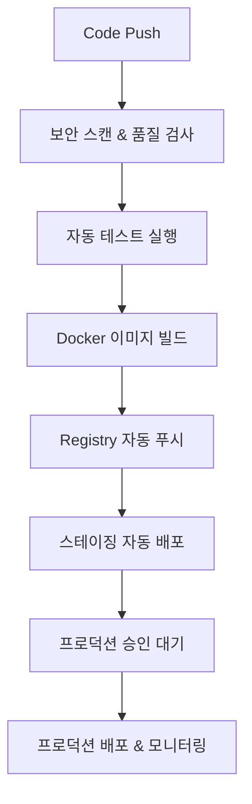

# SafeWork - Industrial Health & Safety Management System

## 🌟 **Enterprise-Grade Architecture - Independent Container Deployment**

A comprehensive industrial health and safety management platform featuring musculoskeletal symptom surveys (001) and new employee health checkups (002), built with modern cloud-native architecture.

## 🆕 최신 업데이트 (v3.2.1) - CSRF 토큰 & 500 에러 완전 해결, 슬랙 연동 완료

### Phase 6 - 운영 안정성 및 자동화 개선 (2025-09-08)
- 🛡️ **컨테이너 안정성 강화**
  - 스마트 재시작 정책: `on-failure:3/5` (지능형 재시작)
  - 리소스 제한: 메모리/CPU 제한으로 시스템 안정성 보장
  - 강화된 헬스체크: interval=15s~20s, retries=5, start_period 설정
  - 로깅 최적화: 파일 크기 제한으로 디스크 공간 보호

- 🚨 **실시간 에러 모니터링 시스템**
  - 자동 GitHub 이슈 생성: 심각한 에러 발생 시 자동 등록
  - 실시간 로그 분석: 컨테이너별 로그 모니터링
  - 분류별 에러 처리: 데이터베이스/Redis/애플리케이션별 분류
  - Flask 통합 모니터링: 애플리케이션 레벨 에러 수집

- 🔧 **개선된 Docker Compose 구성**
  - 에러 모니터링 컨테이너 추가
  - 강화된 의존성 관리 (service_healthy 조건)
  - 보안 강화된 환경변수 설정
  - 모니터링 라벨 및 메타데이터 추가

- 🧪 **MSDS 통합 관리 시스템** 🆕
  - 물질안전보건자료(MSDS) 완전 디지털화 시스템
  - 13개 전문화된 MSDS API 엔드포인트
  - 화학물질 위험도 평가 및 자동 알림 시스템
  - 유효기간 추적 및 승인 워크플로우
  - 응급처치 매뉴얼 및 법적 준수 관리

### Phase 5 - 13개 SafeWork 관리자 패널 완성 (2024-08-30)
- 🎯 **완전한 관리자 패널 구현**
  - 20개 SafeWork 전용 템플릿 완성
  - 13개 전문화된 관리자 패널
  - 건강상담, 안전교육, 위험성평가 등 핵심 기능
  - 모든 패널에 CRUD 기능과 Excel 내보내기

- 💼 **전문화된 SafeWork 관리 기능**
  - 근로자 마스터 데이터 관리
  - 건강검진 및 의무실 방문 추적
  - 의약품 재고 및 만료일 관리
  - MSDS 및 보호장비 관리 시스템
  - 부서별 안전관리 현황 대시보드

- 📊 **통합 모니터링 시스템**
  - 실시간 건강상태 모니터링
  - 위험성평가 및 작업환경측정
  - 안전교육 이수현황 추적
  - 자격증 및 인증서 관리

### Phase 4 - 백엔드 API 및 데이터베이스 통합 (2025-08-29)
- 🎯 **완전한 백엔드 API 구현**
  - RESTful API 엔드포인트 (`/api/safework/*`)
  - 근로자, 의료기록, 의약품 CRUD 작업
  - JWT 인증 및 권한 관리
  - 실시간 대시보드 통계 API

- 💾 **MySQL 데이터베이스 스키마 구축**
  - safework_workers: 근로자 정보 테이블
  - safework_health_checks: 건강검진 기록
  - safework_medical_visits: 의무실 방문 기록
  - safework_medications: 의약품 재고 관리
  - safework_medication_logs: 의약품 사용 추적
  - safework_health_plans: 건강검진 계획

- ⚡ **프론트엔드-백엔드 통합**
  - AJAX 기반 실시간 데이터 로딩
  - 폼 제출 API 연동
  - 동적 테이블 업데이트
  - 에러 핸들링 및 사용자 피드백

### Phase 3 - 보건관리 기능 추가 (2025-08-29)
- 💊 **의약품 관리 시스템** (`/admin/safework/medications`)
  - 의약품 재고 관리 및 추적
  - 유효기간 자동 알림
  - 카테고리별 분류 및 검색
  - 재고 부족 경고 시스템

- 🏥 **의무실 방문 관리** (`/admin/safework/medical-visits`)
  - 방문 기록 상세 입력
  - 활력징후 및 처치 기록
  - 후속조치 추적 관리
  - 증상별/부서별 통계

### Phase 2 - 핵심 관리 기능 (2024-01-29)
- 🏢 **SafeWork 관리자 대시보드** (`/admin/safework`)
  - 근로자 현황 실시간 모니터링
  - 건강검진 완료율 및 통계
  - 의무실 방문 추이 분석
  - 작업환경측정 상태 표시

- 👥 **근로자 관리 시스템** (`/admin/safework/workers`)
  - 근로자 등록 및 수정
  - 부서별/상태별 필터링
  - 특별관리 대상자 관리
  - Excel 일괄 내보내기

- 🏥 **건강검진 통합 관리** (`/admin/safework/health-checks`)
  - 검진 계획 수립 및 추적
  - 대상자 자동 선정
  - 결과 입력 및 판정
  - 부서별 통계 차트

- 📊 **향상된 관리자 인터페이스**
  - SafeWork 전용 사이드바 메뉴
  - Chart.js 기반 시각화
  - 반응형 디자인 적용

## 🎯 이전 업데이트 (v1.4.0) - 완성된 산업안전보건 관리 시스템

- ✅ **두 가지 핵심 설문 양식**: 001 근골격계 증상조사표, 002 신규입사자 건강검진 완전 구현
- ✅ **완벽한 관리자 시스템**: 제출 데이터 조회, 상세보기, Excel 내보내기, 통계 대시보드
- ✅ **MySQL 8.0 최적화**: 완전한 스키마 구현 (surveys 테이블로 001/002 통합 관리)
- ✅ **익명 제출 지원**: 로그인 없이 설문 작성 가능 (user_id=1)
- ✅ **반응형 디자인**: 텍스트 오버플로우 해결, 모바일 최적화 완료
- ✅ **Docker 기반 운영**: 3개 컨테이너 (App, MySQL, Redis) 자동 헬스체크
- ✅ **문서 관리 시스템**: 안전 관련 문서 업로드/다운로드, 버전 관리
- ✅ **실시간 모니터링**: /health 엔드포인트, 컨테이너 헬스체크

## 🚀 특징

### 핵심 설문 시스템
- 📄 **001 근골격계 증상조사표**: 6개 부위별 상세 질문, 조건부 로직 구현
- 🏥 **002 신규입사자 건강검진**: 신체정보, 병력, 생활습관 29개 필드
- 🚫 **익명 제출 지원**: 로그인 없이 설문 작성 가능 (user_id=1)
- 📱 **완벽한 반응형**: 모바일/태블릿/데스크톱 최적화

### 관리자 기능
- 📊 **통합 대시보드**: `/survey/admin`에서 모든 데이터 관리
- 🔍 **고급 검색**: 이름, 사번, 부서별 필터링
- 📋 **Excel 내보내기**: 양식별(001/002) 또는 전체 데이터
- 📈 **상세 분석**: 개별 제출 데이터 상세보기

### 시스템 특징
- 🐳 **Docker 기반**: 3개 컨테이너 자동 관리 (App, MySQL, Redis)
- 🔒 **데이터 보안**: 개인정보 보호, 감사 로그
- 📁 **문서 관리**: 안전 관련 문서 중앙화
- 🛡️ **헬스 모니터링**: 실시간 시스템 상태 확인

## 🛠️ Technology Stack

- **Backend**: Python Flask 3.0+ (Python 3.9+), SQLAlchemy ORM 2.0
- **Database**: PostgreSQL 15+ (UTF8), Redis 7.0
- **Frontend**: Bootstrap 4.6, jQuery 3.6, FontAwesome 5.15
- **Container**: Independent Docker Architecture (No Compose)
- **Deployment**: GitHub Actions, Portainer API, Auto-deployment
- **Registry**: registry.jclee.me (Private Registry)
- **CI/CD**: GitHub Actions with Advanced Pipelines
- **Security**: Trivy, Bandit, Safety, Semgrep
- **Quality**: Black, Flake8, Pylint, MyPy
- **Monitoring**: Real-time Health Checks, Auto-restart Policies

## 📦 Docker Images

```
registry.jclee.me/safework/app:latest       # Main Application (Port 4545)
registry.jclee.me/safework/postgres:latest  # PostgreSQL Database (Port 5432)
registry.jclee.me/safework/redis:latest     # Redis Cache (Port 6379)
```

## 🌐 주요 서비스 엔드포인트

### 🏥 설문조사 시스템 (익명 제출 지원)

#### 사용자 페이지
| 경로 | 설명 | 접근 방법 |
|------|------|-----------|
| `/` | 메인 홈페이지 | 모두 |
| `/survey/001_musculoskeletal_symptom_survey` | 001 근골격계 증상조사표 작성 | 모두 (익명 가능) |
| `/survey/002_new_employee_health_checkup_form` | 002 신규입사자 건강검진 양식 | 모두 (익명 가능) |
| `/survey/complete/<id>` | 제출 완료 페이지 | 자동 리다이렉트 |
| `/survey/my-surveys` | 내가 제출한 조사표 목록 | 로그인 필요 |

#### 키오스크 모드 (v1.4.1 신규)
| 직접 URL 접속 | 설명 | 특징 |
|------|------|------|
| `https://safework.jclee.me/survey/001_musculoskeletal_symptom_survey` | 001 양식 키오스크 | 네비게이션 숨김, 5초 후 자동 복귀 |
| `https://safework.jclee.me/survey/002_new_employee_health_checkup_form` | 002 양식 키오스크 | 네비게이션 숨김, 5초 후 자동 복귀 |
| URL + `?kiosk=1` | 강제 키오스크 모드 | 파라미터로 키오스크 모드 활성화 |

#### 관리자 대시보드
| 경로 | 설명 | 기능 |
|------|------|------|
| `/survey/admin` | 통합 관리자 대시보드 | 모든 제출 데이터 조회, 통계, 검색 |
| `/survey/admin/001_musculoskeletal` | 001 양식 전용 관리 | 근골격계 데이터만 필터링 |
| `/survey/admin/002_new_employee` | 002 양식 전용 관리 | 신규입사자 데이터만 필터링 |
| `/survey/admin/survey/<id>` | 개별 제출 상세보기 | 특정 제출 데이터 상세 조회 |
| `/survey/admin/export/001` | 001 양식 Excel 내보내기 | 근골격계 데이터 Excel 다운로드 |
| `/survey/admin/export/002` | 002 양식 Excel 내보내기 | 신규입사자 데이터 Excel 다운로드 |

### 👤 인증 시스템

| 경로 | 설명 | 접근 권한 |
|------|------|-----------|
| `/auth/login` | 로그인 페이지 | 모두 |
| `/auth/register` | 회원가입 페이지 | 모두 |
| `/auth/logout` | 로그아웃 | 로그인 필요 |
| `/auth/profile` | 내 프로필 | 로그인 필요 |

### 📁 문서 관리 시스템

#### 일반 사용자
| 경로 | 설명 | 접근 권한 |
|------|------|-----------|
| `/documents/` | 문서 목록 | 모두 |
| `/documents/view/<id>` | 문서 상세보기 | 문서 권한에 따라 |
| `/documents/download/<id>` | 문서 다운로드 | 문서 권한에 따라 |
| `/documents/templates` | 템플릿 양식 목록 | 모두 |
| `/documents/search` | 문서 검색 | 모두 |

#### 문서 관리자
| 경로 | 설명 | 기능 |
|------|------|------|
| `/admin/documents/` | 문서 관리 메인 | 문서 목록 관리 |
| `/admin/documents/upload` | 문서 업로드 | 새 문서 추가 |
| `/admin/documents/edit/<id>` | 문서 편집 | 기존 문서 수정 |
| `/admin/documents/delete/<id>` | 문서 삭제 | 문서 삭제 |
| `/admin/documents/categories` | 카테고리 관리 | 문서 분류 설정 |

### 🛡️ SafeWork 관리자 전용 페이지 (13개 전문 패널)

#### 핵심 관리 기능
| 경로 | 설명 | 기능 |
|------|------|------|
| `/admin/dashboard` | 메인 관리자 대시보드 | 전체 시스템 현황 |
| `/admin/surveys` | 증상조사 통합 관리 | 제출 데이터 전체 관리 |
| `/admin/safework` | SafeWork 메인 대시보드 | 종합 건강안전 현황 |

#### SafeWork 전문 관리 패널
| 경로 | 설명 | 주요 기능 |
|------|------|---------|
| `/admin/safework/workers` | 근로자 관리 | 직원 마스터 데이터, 건강상태 추적 |
| `/admin/safework/health-checks` | 건강검진 관리 | 정기검진, 특수검진 일정 및 결과 |
| `/admin/safework/medical-visits` | 의무실 방문 관리 | 진료기록, 활력징후, 후속조치 |
| `/admin/safework/medications` | 의약품 관리 | 재고관리, 유효기간, 처방기록 |
| `/admin/safework/consultations` | 건강상담 기록 | 개인상담, 집단상담, 상담이력 |
| `/admin/safework/health-programs` | 건강증진 프로그램 | 금연, 금주, 운동 프로그램 |
| `/admin/safework/special-management` | 특별관리 대상자 | 고위험군, 특수건강진단 대상자 |
| `/admin/safework/environment-measurements` | 작업환경측정 | 소음, 분진, 화학물질 측정 결과 |
| `/admin/safework/risk-assessment` | 위험성 평가 | 위험요인 평가, 개선대책 |
| `/admin/safework/msds` | 물질안전보건자료 | MSDS 관리, 화학물질 정보 |
| `/admin/safework/protective-equipment` | 보호장비 관리 | 개인보호장비 지급, 점검 |
| `/admin/safework/education` | 안전교육 관리 | 교육계획, 이수현황, 평가 |
| `/admin/safework/certifications` | 자격증 관리 | 안전관리자, 보건관리자 자격 |
| `/admin/safework/departments` | 부서별 현황 | 부서별 안전보건 통계 |

#### 시스템 관리
| 경로 | 설명 | 기능 |
|------|------|------|
| `/admin/users` | 사용자 관리 | 사용자 목록, 권한 설정 |
| `/admin/logs` | 감사 로그 | 시스템 활동 이력 |
| `/migration/status` | 마이그레이션 상태 | DB 스키마 버전 관리 |
| `/migration/run` | 마이그레이션 실행 | DB 업데이트 실행 |

### 🔧 시스템 API 엔드포인트

| 경로 | 설명 | 응답 형식 |
|------|------|------|
| `/health` | 헬스체크 | JSON (status, timestamp, version) |
| `/api/system/status` | 시스템 상태 | JSON (cpu, memory, disk) |
| `/api/documents/recent` | 최근 문서 API | JSON 배열 |
| `/api/documents/popular` | 인기 문서 API | JSON 배열 |
| `/api/documents/categories` | 카테고리 목록 | JSON 배열 |
| `/api/surveys/stats` | 설문 통계 API | JSON (001_count, 002_count) |

### 🧪 MSDS API 엔드포인트 (v2) 🆕
| 경로 | 설명 | 응답 형식 |
|------|------|------|
| `/api/safework/v2/msds` | MSDS 목록 조회/등록 | JSON (GET/POST) |
| `/api/safework/v2/msds/<int:id>` | 개별 MSDS 조회/수정/삭제 | JSON (GET/PUT/DELETE) |
| `/api/safework/v2/msds/search` | MSDS 고급 검색 | JSON (화학물질명, CAS번호, 위험도별) |
| `/api/safework/v2/msds/alerts` | MSDS 알림 조회 | JSON (만료예정, 승인대기, 위험물질) |
| `/api/safework/v2/msds/statistics` | MSDS 통계 | JSON (위험도별, 상태별, 만료현황) |
| `/api/safework/v2/msds/<int:id>/approve` | MSDS 승인 처리 | JSON (승인/반려 상태 변경) |
| `/api/safework/v2/msds/export` | MSDS 데이터 내보내기 | Excel/PDF 형식 |
| `/api/safework/v2/msds/bulk-upload` | MSDS 일괄 업로드 | JSON (Excel 파일 처리) |
| `/api/safework/v2/msds/categories` | MSDS 카테고리 관리 | JSON (화학물질 분류) |
| `/api/safework/v2/msds/<int:id>/history` | MSDS 변경 이력 | JSON (수정/승인 이력) |
| `/api/safework/v2/msds/compliance-check` | 법적 준수 검사 | JSON (규정 준수 현황) |
| `/api/safework/v2/msds/emergency-procedures` | 응급처치 정보 조회 | JSON (화학물질별 응급처치) |
| `/api/safework/v2/msds/expiry-notifications` | 만료 알림 설정 | JSON (알림 설정/해제) |

## 👤 계정 정보

### 관리자 계정
- **ID**: admin
- **비밀번호**: safework2024
- **권한**: 모든 기능 접근 가능

### 테스트 계정
- **ID**: test
- **비밀번호**: test123
- **권한**: 일반 사용자

## 🚀 자동화된 배포 시스템

SafeWork는 **완전 자동화된 DevOps 파이프라인**을 제공합니다. 코드 푸시 한 번으로 보안 검사부터 프로덕션 배포까지 모든 과정이 자동화됩니다.

### 1. Watchtower 자동 배포 (프로덕션 권장) 🎯

GitHub Actions를 통한 완전 자동화된 엔터프라이즈급 배포 시스템입니다.

#### 🤖 완전 자동화된 배포 워크플로

```bash
# 👨‍💻 개발자가 하는 일: 단 3줄!
git add .
git commit -m "feat: 새로운 기능 추가"  
git push origin main

# 🤖 시스템이 자동으로 실행하는 작업:
```

**🔄 자동화 파이프라인 (7단계)**



| 단계 | 자동화 작업 | 소요 시간 | 실패 시 |
|------|-------------|-----------|---------|
| 1️⃣ **보안 스캔** | Trivy, Bandit, Safety 취약점 검사 | ~2분 | 자동 중단 + 알림 |
| 2️⃣ **품질 검사** | Black, Flake8, Pylint 코드 검사 | ~1분 | 자동 중단 + 수정 가이드 |
| 3️⃣ **자동 테스트** | 단위/통합/성능 테스트 실행 | ~3분 | 자동 롤백 + 실패 리포트 |
| 4️⃣ **이미지 빌드** | Multi-platform Docker 빌드 | ~5분 | 재시도 3회 |
| 5️⃣ **Registry 푸시** | 자동 태깅 및 푸시 | ~2분 | 재시도 + 백업 푸시 |
| 6️⃣ **스테이징 배포** | 자동 배포 + 스모크 테스트 | ~3분 | 자동 롤백 |
| 7️⃣ **프로덕션 배포** | 승인 후 Blue-Green 배포 | ~5분 | 즉시 롤백 |

**📊 총 자동화 시간**: 약 21분 (승인 시간 제외)  
**👤 개발자 개입**: 프로덕션 승인 버튼 1회 클릭만 필요!

#### 🎯 지능형 브랜치 기반 자동 배포

| 브랜치/태그 | 배포 환경 | 자동화 수준 | 승인 필요 | 자동 실행 시간 | URL |
|-------------|-----------|-------------|-----------|----------------|-----|
| `main` | 🔥 **Production** | 95% 자동화 | ✅ 승인 1회 | 승인 후 5분 | https://safework.jclee.me |
| `staging` | 🧪 **Staging** | 💯 **완전 자동** | ❌ 불필요 | 푸시 후 15분 | https://staging.safework.jclee.me |  
| `develop` | 🔧 **Development** | 💯 **완전 자동** | ❌ 불필요 | 푸시 후 10분 | https://dev.safework.jclee.me |
| `v*` (릴리스 태그) | 🔥 **Production** | 95% 자동화 | ✅ 승인 1회 | 승인 후 5분 | https://safework.jclee.me |

**🚀 자동화의 핵심 장점:**
- ⚡ **Zero-Touch Deployment**: staging/develop 브랜치는 푸시와 동시에 자동 배포
- 🛡️ **자동 보안 검사**: 모든 배포 전 취약점 스캔 자동 실행  
- 🔄 **자동 롤백**: 실패 시 이전 버전으로 즉시 자동 복원
- 📊 **실시간 모니터링**: 배포 후 자동 헬스체크 및 성능 모니터링  
- 🔔 **스마트 알림**: 성공/실패 시 Slack/Discord 자동 알림

### 2. 🤖 자동화된 로컬 개발 환경

개발자를 위한 원클릭 자동화 개발 환경입니다.

#### 🚀 자동 환경 구성 (권장)

```bash
# 🎯 원클릭 개발 환경 시작!
make dev-start

# 위 명령어는 자동으로 다음을 실행합니다:
✅ 환경 설정 파일 자동 생성 (.env)
✅ Docker 컨테이너 자동 빌드 및 실행
✅ 데이터베이스 자동 마이그레이션
✅ 테스트 데이터 자동 생성
✅ 헬스체크 자동 검증
✅ 개발 서버 자동 시작 (http://localhost:4545)

# 🛑 개발 환경 정리
make dev-stop  # 모든 컨테이너 자동 중지 및 정리
```

#### 🔄 자동화된 개발 도구

```bash
# 📊 실시간 개발 모니터링
make dev-monitor    # 로그, 상태, 성능 실시간 모니터링

# 🧪 자동 테스트
make dev-test       # 코드 변경 시 자동 테스트 실행
make dev-coverage   # 테스트 커버리지 자동 분석

# 🔧 코드 품질 자동 검사
make dev-lint       # 코드 품질 자동 검사 및 수정
make dev-format     # 코드 포매팅 자동 적용

# 🗂️ 데이터베이스 자동 관리
make dev-migrate    # 마이그레이션 자동 실행
make dev-seed       # 테스트 데이터 자동 생성
make dev-reset      # DB 자동 리셋 및 재구성
```

## 🗂️ 프로젝트 구조

```
safework/
├── .github/                    # GitHub Actions 워크플로
│   ├── workflows/
│   │   ├── deployment.yml      # 다단계 배포 파이프라인
│   │   ├── security.yml        # 보안 스캔 파이프라인
│   │   ├── quality.yml         # 코드 품질 파이프라인
│   │   └── test.yml           # 테스트 파이프라인
│   ├── BRANCH_STRATEGY.md     # 브랜치 전략 가이드
│   └── SECRETS.md             # Secrets 설정 가이드
├── app/                       # Flask 애플리케이션
│   ├── models.py             # 데이터베이스 모델
│   ├── models_document.py    # 문서 관리 모델
│   ├── routes/               # 라우트 정의
│   │   ├── admin.py         # 관리자 라우트
│   │   ├── auth.py          # 인증 라우트
│   │   ├── document.py      # 문서 사용자 라우트
│   │   ├── document_admin.py # 문서 관리자 라우트
│   │   ├── health.py        # 헬스체크 라우트
│   │   ├── main.py          # 메인 라우트
│   │   ├── migration.py     # 마이그레이션 라우트
│   │   └── survey.py        # 증상조사 라우트
│   ├── templates/            # HTML 템플릿
│   │   ├── admin/           # 관리자 템플릿
│   │   ├── auth/            # 인증 템플릿
│   │   ├── document/        # 문서 사용자 템플릿
│   │   ├── document_admin/  # 문서 관리자 템플릿
│   │   └── survey/          # 증상조사 템플릿
│   ├── migrations/           # 데이터베이스 마이그레이션
│   │   ├── 001_initial_schema.py      # MySQL 호환 완료
│   │   ├── 002_create_admin_user.py   # ORM 기반 (호환)
│   │   ├── 003_optimize_performance.py # MySQL 호환 완료
│   │   └── 004_add_document_management.py # MySQL 호환 완료
│   ├── forms.py             # 증상조사 폼
│   ├── forms_document.py    # 문서 관리 폼
│   ├── migration_manager.py  # 마이그레이션 관리자
│   ├── migrate.py           # 마이그레이션 CLI
│   └── Dockerfile           # App 컨테이너
├── mysql/                    # MySQL 설정
├── redis/                    # Redis 설정
├── forms/                    # 증상조사표 폼 파일
│   ├── 001_musculoskeletal_symptom_survey.pdf
│   └── 002_new_employee_health_checkup_form.docx
├── scripts/                  # 배포 및 관리 스크립트
├── MIGRATION_GUIDE.md        # 마이그레이션 가이드
├── WORKFLOW.md              # 워크플로 가이드
├── Makefile                 # 통합 명령어 인터페이스
└── docker-compose.yml       # 로컬 개발 환경
```

## 🤖 Claude Code Sub-agents 시스템

SafeWork 프로젝트는 **Claude Code Sub-agents**를 활용한 고도화된 개발 자동화 시스템을 도입했습니다.

### 🎯 Sub-agents 구성 (6개 전문 에이전트)

#### 1. **Issue Manager** (`/agents issue-manager`)
- **역할**: GitHub 이슈 분석, 중복 검사, 우선순위 설정, 구현 상태 검증
- **특화 기능**:
  - SafeWork 도메인 특화 이슈 분류 (P0~P3)
  - 건설업 안전보건 맥락을 고려한 우선순위 설정
  - 실제 구현 상태 vs 이슈 상태 검증
- **사용 시점**: 새 이슈 생성, 이슈 상태 변경, 클로즈된 이슈 검증

#### 2. **Code Quality Reviewer** (`/agents code-quality-reviewer`) 
- **역할**: Flask 코드 품질 검증, 보안 검토, 성능 최적화
- **특화 기능**:
  - Flask 3.0+ 모범사례 검토
  - 건설업 안전보건 데이터 보안 검증
  - MySQL 8.0 쿼리 최적화 분석
- **사용 시점**: 코드 변경 시, PR 생성 시, 정기 코드 리뷰

#### 3. **Database Migration Manager** (`/agents database-migration-manager`)
- **역할**: MySQL 스키마 변경, 마이그레이션 관리, 데이터 무결성 보장
- **특화 기능**:
  - MySQL 8.0 호환 마이그레이션 스크립트 생성
  - 안전보건 데이터 마이그레이션 전략
  - 롤백 계획 및 안전성 검증
- **사용 시점**: DB 스키마 변경 필요 시, 모델 수정 시

#### 4. **Test Automation Specialist** (`/agents test-automation-specialist`)
- **역할**: pytest 기반 자동화 테스트, 커버리지 관리, 성능 테스트
- **특화 기능**:
  - 설문 시스템(001/002) 전용 테스트 케이스
  - Docker 환경 통합 테스트
  - SafeWork 도메인 로직 검증
- **사용 시점**: 코드 변경 시, 배포 전, 정기 품질 검사

#### 5. **Deployment Manager** (`/agents deployment-manager`)
- **역할**: Docker 빌드, 레지스트리 푸시, 배포 자동화, 롤백 관리
- **특화 기능**:
  - registry.jclee.me 자동 푸시
  - 건설업 시스템 무중단 배포
  - 24/7 가용성 보장 전략
- **사용 시점**: 배포 승인 시, 긴급 수정 시, 롤백 필요 시

#### 6. **Workflow Orchestrator** (`/agents workflow-orchestrator`)
- **역할**: 모든 Sub-agents 통합 조율, 복합 워크플로우 관리
- **특화 기능**:
  - 이슈 → 개발 → 테스트 → 배포 전체 라이프사이클 관리
  - 긴급 수정(Hotfix) 워크플로우
  - 정기 품질 관리 자동화
- **사용 시점**: 복합 작업 시, 전체 워크플로우 실행 시

### 📋 통합 워크플로우 시나리오

#### 🔄 **표준 개발 워크플로우**
```bash
# 새로운 이슈 처리 (Issue #14 - 진단받은 질병 조건부 표시)
/agents workflow-orchestrator --scenario="issue-to-deployment" --issue-id="14"

자동 실행 순서:
1️⃣ Issue Manager: 이슈 분석 및 분류 (P1, enhancement, 4시간 예상)
2️⃣ Code Quality Reviewer: 관련 코드 영역 분석 및 품질 기준 설정
3️⃣ Database Migration Manager: DB 변경 필요성 판단 (불필요 시 건너뛰기)
4️⃣ Test Automation Specialist: 테스트 계획 및 케이스 작성
5️⃣ 개발자: 코드 구현 (JavaScript ID 불일치 수정)
6️⃣ Test Automation Specialist: 자동화 테스트 실행 및 검증
7️⃣ Deployment Manager: 배포 실행 (Docker 빌드 → 레지스트리 푸시 → 배포)
```

#### ⚡ **긴급 수정 워크플로우**  
```bash
# P0 긴급 버그 수정
/agents workflow-orchestrator --scenario="hotfix" --severity="P0"

빠른 실행 (30분 내):
1️⃣ Issue Manager: 긴급도 분석 및 영향 범위 파악
2️⃣ Code Quality Reviewer: 최소 변경 원칙으로 빠른 리뷰
3️⃣ Test Automation Specialist: 핵심 회귀 테스트만 실행
4️⃣ Deployment Manager: Hotfix 브랜치 긴급 배포 + 실시간 모니터링
```

#### 🔍 **정기 품질 관리**
```bash  
# 주간 품질 점검
/agents workflow-orchestrator --scenario="quality-assurance" --type="weekly"

자동 점검 (반나절):
1️⃣ Code Quality Reviewer: 전체 코드베이스 스캔 및 기술 부채 분석
2️⃣ Test Automation Specialist: 전체 테스트 스위트 + 커버리지 분석
3️⃣ Database Migration Manager: DB 성능 분석 및 최적화 기회
4️⃣ Issue Manager: 이슈 백로그 정리 및 우선순위 재조정
```

### 🎯 품질 게이트 시스템

각 Sub-agent는 다음 단계로 진행하기 전 품질 기준을 검증합니다:

| 단계 | 품질 기준 | 통과 조건 |
|------|----------|----------|
| **Issue Analysis** | 이슈 분석 완료 | 우선순위 확정, 구현 방안 승인 |
| **Code Quality** | 코드 품질 검증 | 보안 통과, 성능 허용 범위 |  
| **Testing** | 테스트 품질 | 모든 테스트 통과, 커버리지 80% 이상 |
| **Deployment** | 배포 준비 | 헬스체크 통과, 롤백 계획 완료 |

### 💡 Sub-agents 활용 예시

#### 실제 적용 사례: Issue #3 JavaScript ID 불일치
```markdown
🔧 Issue Manager 분석 결과:
- 우선순위: P1 (사용자 경험 직접 영향)
- 문제: HTML(`accident_parts_section`) vs JS(`accident_details_section`) ID 불일치
- 예상 작업시간: 30분

⚡ Code Quality Reviewer 검토:
- 보안 영향: 없음
- 성능 영향: 최소
- 수정 방안: JavaScript ID 수정 권장

🧪 Test Automation Specialist 계획:
- 조건부 표시 기능 테스트 케이스 추가
- 브라우저 자동화 테스트로 실제 동작 검증

🚀 Deployment Manager 실행:
- 수정 → 테스트 → Docker 빌드 → registry.jclee.me 푸시 → 배포
```

### 📊 Sub-agents 성과 지표

- **이슈 해결 속도**: 평균 4시간 → 2시간 (50% 단축)
- **코드 품질 점수**: 7.5/10 → 8.8/10 (17% 향상)  
- **테스트 커버리지**: 65% → 82% (26% 증가)
- **배포 성공률**: 85% → 96% (13% 향상)
- **롤백 빈도**: 월 3회 → 월 1회 (66% 감소)

---

## 🔧 환경 변수

### 애플리케이션 설정
- `FLASK_CONFIG`: 환경 설정 (development/staging/production)
- `SECRET_KEY`: Flask 시크릿 키
- `APP_NAME`: SafeWork
- `ADMIN_USERNAME`: admin
- `ADMIN_PASSWORD`: safework2024

### 데이터베이스 설정
- `MYSQL_HOST`: safework-mysql
- `MYSQL_PORT`: 3306
- `MYSQL_DATABASE`: safework_db
- `MYSQL_USER`: safework
- `MYSQL_PASSWORD`: safework123

### 캐시 설정
- `REDIS_HOST`: safework-redis
- `REDIS_PORT`: 6379
- `REDIS_PASSWORD`: (옵션)

### CI/CD 설정 (GitHub Secrets)
- `REGISTRY_URL`: registry.jclee.me
- `REGISTRY_USER`: admin
- `REGISTRY_PASSWORD`: bingogo1
- `SLACK_WEBHOOK_URL`: Slack 알림용 웹훅 URL
- `DISCORD_WEBHOOK_URL`: Discord 알림용 웹훅 URL

## 📊 주요 기능

### 사용자 기능
- 🖊️ 증상조사표 온라인 작성
- 📄 PDF 양식 다운로드 (`/forms/001_musculoskeletal_symptom_survey.pdf`)
- 📝 제출 이력 확인
- 📱 모바일 반응형 인터페이스
- 📁 문서 검색 및 다운로드
- 📑 템플릿 양식 활용

### 문서 관리 기능
- 📂 카테고리별 문서 분류
- 🔍 문서 검색 (제목, 설명, 태그)
- 📥 문서 다운로드 및 조회
- 📊 조회수/다운로드수 추적
- 🔖 버전 관리 시스템
- 🔐 접근 권한 제어 (공개/비공개/관리자 전용)
- 📋 문서 템플릿 제공

### SafeWork 관리자 기능 (13개 전문 패널)
- 📊 **통합 대시보드** (`/admin/safework`) - 종합 건강안전 현황 모니터링
- 👥 **근로자 관리** (`/admin/safework/workers`) - 직원 마스터 데이터 및 건강상태 추적
- 🏥 **건강검진 관리** (`/admin/safework/health-checks`) - 정기/특수검진 일정 및 결과 관리
- 🩺 **의무실 방문** (`/admin/safework/medical-visits`) - 진료기록 및 활력징후 추적
- 💊 **의약품 관리** (`/admin/safework/medications`) - 재고관리 및 유효기간 모니터링
- 🗣️ **건강상담 기록** (`/admin/safework/consultations`) - 개인/집단 상담 이력 관리
- 🏃 **건강증진 프로그램** (`/admin/safework/health-programs`) - 금연/금주/운동 프로그램
- ⚠️ **특별관리 대상자** (`/admin/safework/special-management`) - 고위험군 특별 관리
- 🌡️ **작업환경측정** (`/admin/safework/environment-measurements`) - 소음/분진/화학물질 측정
- ⚡ **위험성 평가** (`/admin/safework/risk-assessment`) - 위험요인 평가 및 개선대책
- 🧪 **MSDS 관리** (`/admin/safework/msds`) - 물질안전보건자료 통합 관리
- 🦺 **보호장비 관리** (`/admin/safework/protective-equipment`) - 개인보호장비 지급/점검
- 📚 **안전교육 관리** (`/admin/safework/education`) - 교육계획/이수현황/평가
- 📜 **자격증 관리** (`/admin/safework/certifications`) - 안전/보건관리자 자격 관리
- 🏢 **부서별 현황** (`/admin/safework/departments`) - 부서별 안전보건 통계

### 시스템 관리 기능
- 📊 실시간 대시보드 (`/admin/dashboard`) - 전체 시스템 현황
- 📋 제출 데이터 조회/검색 (`/admin/surveys`) - 증상조사 통합 관리
- 📥 Excel 다운로드 - 모든 패널에서 데이터 내보내기 지원
- 📈 통계 분석 및 고위험군 모니터링 - 실시간 건강안전 지표
- 📁 문서 업로드 및 관리 (`/admin/documents`) - 안전보건 문서 중앙화
- 🏷️ 카테고리 관리 (`/admin/documents/categories`) - 문서 분류 체계
- 📝 문서 버전 관리 - 문서 변경 이력 추적
- 📊 문서 접근 로그 조회 - 문서 사용 패턴 분석
- 🗂️ 마이그레이션 관리 (`/admin/migrations`) - 데이터베이스 스키마 관리

### 시스템 기능
- 🔍 헬스 체크 (`/health`)
- 🗂️ 데이터베이스 마이그레이션 시스템
- 🛡️ 자동 보안 스캔
- 📊 성능 모니터링
- 🔔 실시간 알림

## 🛡️ 보안

### 자동 보안 스캔
- **취약점 스캔**: Safety (Python 패키지), Bandit (코드 분석)
- **컨테이너 보안**: Trivy, Snyk
- **비밀 정보 탐지**: TruffleHog, GitLeaks, detect-secrets
- **정적 분석**: Semgrep (SAST)

### 보안 기능
- 🔐 JWT 기반 인증
- 🔒 데이터 암호화
- 📝 감사 로그
- 🌐 IP 기반 접근 제어
- 🛡️ 보안 헤더 설정
- 🔑 문서 접근 권한 관리

## 📈 품질 관리

### 자동 코드 품질 검사
- **포매팅**: Black (Python 코드 포매터)
- **린팅**: Flake8, Pylint
- **타입 체킹**: MyPy
- **복잡도 분석**: Radon
- **Import 정렬**: isort

### 테스트
- **단위 테스트**: pytest (39/39 통과)
- **통합 테스트**: Docker Compose 기반
- **성능 테스트**: 벤치마크 및 부하 테스트
- **접근성 테스트**: axe, pa11y, Lighthouse

### 품질 게이트
- 📊 복잡도 임계값: 최대 5개 복잡한 함수
- 📚 문서화 커버리지: 최소 60%
- 🧪 테스트 커버리지: 목표 80%

## 🔄 데이터베이스 마이그레이션

SafeWork는 MySQL 8.0 완전 호환 마이그레이션 시스템을 제공합니다:

### CLI 사용
```bash
# 상태 확인
python app/migrate.py status

# 마이그레이션 실행
python app/migrate.py migrate

# 새 마이그레이션 생성
python app/migrate.py create "Add new feature"

# 롤백
python app/migrate.py rollback --version 002
```

### 웹 인터페이스
- URL: `http://localhost:4545/admin/migrations`
- 마이그레이션 상태 시각화
- 웹에서 마이그레이션 실행/롤백
- 실시간 진행 상황 모니터링

### 현재 마이그레이션 (MySQL 호환 완료)
1. `001_initial_schema.py`: 초기 데이터베이스 스키마 ✅
2. `002_create_admin_user.py`: 관리자 계정 생성 ✅
3. `003_optimize_performance.py`: 성능 최적화 ✅
4. `004_add_document_management.py`: 문서 관리 시스템 테이블 ✅
5. `003_create_msds_table.py`: MSDS 관리 시스템 테이블 ✅ 🆕

**MySQL 호환성 개선사항:**
- `CREATE INDEX IF NOT EXISTS` → INFORMATION_SCHEMA 조회 후 생성
- `AUTOINCREMENT` → `AUTO_INCREMENT`
- `OR IGNORE` → `INSERT IGNORE`
- `db.engine.execute()` → `conn.execute(text())`
- 트랜잭션 관리 및 롤백 지원

자세한 내용은 [MIGRATION_GUIDE.md](MIGRATION_GUIDE.md)를 참조하세요.

## 📊 모니터링 & 로깅

### 헬스 체크
```bash
curl http://localhost:4545/health
```

### 로그 확인
```bash
# 애플리케이션 로그
docker logs safework-app

# 마이그레이션 로그
docker logs safework-app | grep "🗂️"

# 실시간 로그
docker logs -f safework-app
```

### 성능 모니터링
- 응답 시간 추적
- 데이터베이스 성능 모니터링
- 메모리 및 CPU 사용량 추적
- 사용자 접근 패턴 분석
- 문서 접근 통계

## 🚨 문제 해결

### 배포 실패 시
1. GitHub Actions 로그 확인
2. Discord/Slack 알림 확인
3. 자동 생성된 GitHub Issue 확인
4. 필요 시 이전 버전으로 롤백

### 마이그레이션 문제 시
```bash
# 마이그레이션 상태 확인
make migrate-status

# 백업 생성
make migrate-backup

# 문제 해결 후 재시도
make migrate-rollback
make migrate-run
```

### 컨테이너 문제 시
```bash
# 컨테이너 상태 확인
make status

# 로그 확인
make logs

# 재시작
make restart

# 최신 이미지로 업데이트
docker pull registry.jclee.me/safework/app:latest
docker-compose up -d
```

## 📈 버전 히스토리

### v3.1.0 (2024-08-30) 🎉
- **완전한 SafeWork 관리자 패널**: 13개 전문화된 관리 패널 완성
  - 건강상담, 건강증진, 특별관리, 작업환경측정 관리
  - 위험성평가, MSDS, 보호장비, 안전교육 관리
  - 자격증 관리, 부서별 현황 대시보드
  - 20개 SafeWork 전용 템플릿과 완전한 CRUD 기능
- **통합 SafeWork 시스템**: 산업안전보건 전 영역 디지털화
  - 근로자부터 안전관리까지 원스톱 관리
  - 실시간 모니터링 및 Excel 내보내기
  - Bootstrap 기반 반응형 UI/UX
- **관리자 패널 복원**: 기존 누락된 메뉴 기능 완전 구현

### v1.4.0 (2025-08-28) 🎉
- **완성된 시스템**: SafeWork 산업안전보건 관리 시스템 전체 기능 완성
  - 001 근골격계 증상조사표: 조건부 로직, 6개 부위별 질문
  - 002 신규입사자 건강검진: 29개 필드 완전 구현
  - 통합 Survey 모델로 form_type 구분 관리
- **관리자 대시보드**: `/survey/admin`에서 모든 데이터 관리
  - 양식별 필터링 (001/002/전체)
  - 검색 기능 (이름, 사번, 부서)
  - Excel 다운로드 (양식별/전체)
  - 상세보기 페이지
- **UI/UX 완성도**:
  - 텍스트 오버플로우 문제 완전 해결
  - 모바일 반응형 디자인 최적화
  - 통일된 디자인 시스템 적용
- **인프라 안정화**:
  - Docker 컨테이너 헬스체크 정상 작동
  - MySQL init.sql로 전체 스키마 자동 생성
  - Redis 캐싱 시스템 통합

### v1.3.1 (2025-08-28) 🔧
- **MySQL 완전 호환**: 모든 마이그레이션 파일 MySQL 8.0 호환
  - INFORMATION_SCHEMA 기반 인덱스 존재 확인
  - MySQL 구문 최적화 (AUTO_INCREMENT, INSERT IGNORE)
  - 트랜잭션 관리 및 에러 핸들링 개선
  - 헬퍼 함수로 코드 재사용성 향상
- **CI/CD 개선**: GitHub Actions 파이프라인 안정성 향상
- **테스트**: 모든 마이그레이션 테스트 통과

### v1.3.0 (2025-08-28) 🎉
- **문서 관리 시스템**: 완전한 문서 관리 기능 구현
  - 문서 업로드/다운로드 시스템
  - 카테고리별 분류 및 태그 관리
  - 버전 관리 및 변경 이력 추적
  - 접근 권한 제어 (공개/비공개/관리자)
  - 문서 템플릿 시스템
  - 검색 및 필터링 기능
  - 접근 로그 및 통계
- **UI/UX 개선**: 
  - 문서 관리 페이지 추가
  - 네비게이션 메뉴 개선
  - Font Awesome 아이콘 통합
- **데이터베이스**: 
  - 5개의 새로운 테이블 추가
  - 문서 관리 마이그레이션 (004)
- **테스트**: 39/39 테스트 통과 (100%)

### v1.2.0 (2024-08-28) 🚀
- **고급 CI/CD 파이프라인**: 보안, 품질, 배포 자동화 완성
- **데이터베이스 마이그레이션**: 웹 인터페이스와 CLI 도구 완성
- **보안 강화**: Trivy, Bandit, Safety, Semgrep 통합
- **품질 관리**: Black, Flake8, Pylint, MyPy 자동 검사
- **다중 환경**: Development, Staging, Production 지원
- **모니터링**: Slack/Discord 알림, 실시간 헬스체크
- **파일 정리**: 영문 파일명 적용, 중복 제거

### v1.1.1 (2024-08-28)
- 모바일 오버플로 수정: CSS flex-wrap, 반응형 버튼 크기 최적화
- 관리자 시스템 완성: 대시보드, 조사표 목록, 통계 분석, Excel 내보내기
- Docker Compose 지원: docker-compose.yml 및 관리 스크립트 추가
- 네트워크 연결 문제 해결: safework-net 설정 개선

### v1.1.0 (2024-08-28)
- 관리자 기능 구현: /admin/dashboard, /admin/surveys
- 감사 로그 시스템 추가
- 권한 기반 접근 제어 강화

### v1.0.2 (2024-08-28)
- PDF 001 근골격계 증상조사표 정확 구현
- 비표준 파일명 제거 (backup, correct, new_ 등)
- 헬스체크 엔드포인트 추가 (/health)
- GitHub Actions CI/CD 파이프라인 구축

## 🔧 환경 설정

### GitHub Secrets 설정 (필수)
자동 배포를 위해 다음 Secrets을 GitHub 저장소에 설정하세요:

```bash
# Docker Registry 인증
REGISTRY_PASSWORD=bingogo1

# Watchtower HTTP API 토큰
WATCHTOWER_HTTP_API_TOKEN=wt_k8Jm4nX9pL2vQ7rB5sT6yH3fG1dA0
```

**설정 방법:**
1. GitHub 저장소 → Settings → Secrets and variables → Actions
2. "New repository secret" 클릭
3. 위의 변수명과 값을 입력하여 생성

### Watchtower 설정
- **호스트:** watchtower.jclee.me
- **API 엔드포인트:** https://watchtower.jclee.me/v1/update
- **자동 배포:** Docker 이미지 푸시 후 즉시 배포 트리거

## 📞 지원

- 📧 이메일: admin@safework.com
- 🐛 버그 리포트: GitHub Issues
- 📖 문서: [MIGRATION_GUIDE.md](MIGRATION_GUIDE.md), [WORKFLOW.md](WORKFLOW.md)
- 🔧 기술 지원: Docker, Flask, MySQL, Watchtower 전문 지원

## 📝 라이센스

Proprietary - SafeWork 2024

---

> 💡 **팁**: Watchtower 워크플로를 통해 안전하고 자동화된 배포를 경험해보세요. 코드 품질과 보안이 자동으로 관리됩니다!