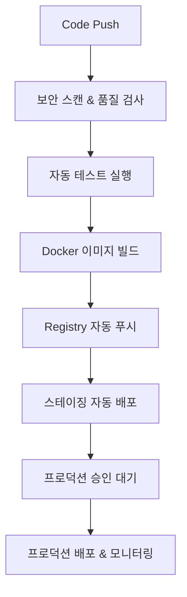

# SafeWork - 근골격계 증상조사표 시스템

PDF 001 근골격계 증상조사표를 정확하게 구현한 온라인 증상조사 시스템 (v1.3.1)

## 🎯 최신 업데이트 (v1.3.1) - MySQL 마이그레이션 완전 호환

- ✅ **MySQL 8.0 완전 호환**: 모든 마이그레이션 MySQL 구문 최적화
- ✅ **문서 관리 시스템**: 문서 업로드/다운로드, 버전 관리, 카테고리 분류
- ✅ **고급 CI/CD 파이프라인**: 보안 스캔, 품질 검사, 다단계 배포 자동화
- ✅ **데이터베이스 마이그레이션 시스템**: 웹 관리 인터페이스와 CLI 도구
- ✅ **보안 강화**: Trivy, Bandit, Safety를 통한 취약점 스캔 자동화
- ✅ **품질 관리**: Black, Flake8, Pylint를 통한 코드 품질 자동 검사
- ✅ **다중 환경 지원**: Development, Staging, Production 환경 자동 관리
- ✅ **모니터링 & 알림**: Slack/Discord 통합 및 실시간 상태 모니터링

## 🚀 특징

- 📄 **PDF 정확 구현**: 001 근골격계 증상조사표와 100% 일치
- 📱 **모바일 최적화**: 반응형 웹 디자인
- 🚫 **익명 제출**: 로그인 없이 작성 가능
- 📊 **실시간 통계**: 관리자 대시보드
- 📋 **Excel 내보내기**: 데이터 분석 지원
- 🔒 **안전한 데이터 관리**: 개인정보 보호
- 📁 **문서 관리 시스템**: 안전 문서, 양식, 교육 자료 중앙 관리
- 🗂️ **마이그레이션 시스템**: 데이터베이스 스키마 버전 관리
- 🛡️ **보안 스캔**: 자동 취약점 검사 및 보안 모니터링

## 🛠️ 기술 스택

- **Backend**: Python Flask 3.0+
- **Database**: MySQL 8.0 with Migration System
- **Cache**: Redis 7.0
- **Container**: Docker with Multi-platform Support
- **Registry**: registry.jclee.me (Private Registry)
- **CI/CD**: GitHub Actions with Advanced Pipelines
- **Security**: Trivy, Bandit, Safety, Semgrep
- **Quality**: Black, Flake8, Pylint, MyPy
- **Monitoring**: Health Checks, Performance Testing

## 📦 Docker 이미지

```
registry.jclee.me/safework/app:latest     # 메인 애플리케이션 (포트 4545)
registry.jclee.me/safework/mysql:latest   # MySQL 데이터베이스 (포트 3306)
registry.jclee.me/safework/redis:latest   # Redis 캐시 (포트 6379)
```

## 🌐 주요 URL 경로

### 일반 사용자 페이지

| 경로 | 설명 | 접근 권한 |
|------|------|-----------|
| `/` | 메인 페이지 | 모두 |
| `/survey/new` | 증상조사표 작성 | 모두 (익명 가능) |
| `/survey/my_surveys` | 내 제출 이력 | 로그인 필요 |
| `/survey/view/<id>` | 제출 조사표 보기 | 로그인 필요 |
| `/auth/login` | 로그인 | 모두 |
| `/auth/register` | 회원가입 | 모두 |
| `/auth/logout` | 로그아웃 | 로그인 필요 |

### 문서 관리 페이지

| 경로 | 설명 | 접근 권한 |
|------|------|-----------|
| `/documents/` | 문서 목록 | 모두 |
| `/documents/view/<id>` | 문서 상세보기 | 문서 권한에 따라 |
| `/documents/download/<id>` | 문서 다운로드 | 문서 권한에 따라 |
| `/documents/templates` | 템플릿 양식 목록 | 모두 |
| `/documents/search` | 문서 검색 | 모두 |

### 관리자 페이지

| 경로 | 설명 | 기능 |
|------|------|------|
| `/admin/dashboard` | 관리자 대시보드 | 통계, 현황 모니터링 |
| `/admin/surveys` | 증상조사 관리 | 제출 데이터 조회, Excel 다운로드 |
| `/admin/users` | 사용자 관리 | 사용자 목록, 권한 관리 |
| `/admin/documents/` | 문서 관리 | 문서 목록, 업로드, 수정, 삭제 |
| `/admin/documents/upload` | 문서 업로드 | 새 문서 추가 |
| `/admin/documents/categories` | 카테고리 관리 | 문서 카테고리 설정 |
| `/admin/migrations` | 마이그레이션 관리 | DB 스키마 버전 관리 |

### 시스템 API

| 경로 | 설명 | 용도 |
|------|------|------|
| `/health` | 헬스체크 | 서비스 상태 확인 |
| `/api/documents/recent` | 최근 문서 API | AJAX 호출용 |
| `/api/documents/popular` | 인기 문서 API | AJAX 호출용 |
| `/api/documents/categories` | 카테고리 목록 API | AJAX 호출용 |

## 👤 계정 정보

### 관리자 계정
- **ID**: admin
- **비밀번호**: safework2024
- **권한**: 모든 기능 접근 가능

### 테스트 계정
- **ID**: test
- **비밀번호**: test123
- **권한**: 일반 사용자

## 🚀 자동화된 배포 시스템

SafeWork는 **완전 자동화된 DevOps 파이프라인**을 제공합니다. 코드 푸시 한 번으로 보안 검사부터 프로덕션 배포까지 모든 과정이 자동화됩니다.

### 1. GitOps 자동 배포 (프로덕션 권장) 🎯

GitHub Actions를 통한 완전 자동화된 엔터프라이즈급 배포 시스템입니다.

#### 🤖 완전 자동화된 배포 워크플로

```bash
# 👨‍💻 개발자가 하는 일: 단 3줄!
git add .
git commit -m "feat: 새로운 기능 추가"  
git push origin main

# 🤖 시스템이 자동으로 실행하는 작업:
```

**🔄 자동화 파이프라인 (7단계)**



| 단계 | 자동화 작업 | 소요 시간 | 실패 시 |
|------|-------------|-----------|---------|
| 1️⃣ **보안 스캔** | Trivy, Bandit, Safety 취약점 검사 | ~2분 | 자동 중단 + 알림 |
| 2️⃣ **품질 검사** | Black, Flake8, Pylint 코드 검사 | ~1분 | 자동 중단 + 수정 가이드 |
| 3️⃣ **자동 테스트** | 단위/통합/성능 테스트 실행 | ~3분 | 자동 롤백 + 실패 리포트 |
| 4️⃣ **이미지 빌드** | Multi-platform Docker 빌드 | ~5분 | 재시도 3회 |
| 5️⃣ **Registry 푸시** | 자동 태깅 및 푸시 | ~2분 | 재시도 + 백업 푸시 |
| 6️⃣ **스테이징 배포** | 자동 배포 + 스모크 테스트 | ~3분 | 자동 롤백 |
| 7️⃣ **프로덕션 배포** | 승인 후 Blue-Green 배포 | ~5분 | 즉시 롤백 |

**📊 총 자동화 시간**: 약 21분 (승인 시간 제외)  
**👤 개발자 개입**: 프로덕션 승인 버튼 1회 클릭만 필요!

#### 🎯 지능형 브랜치 기반 자동 배포

| 브랜치/태그 | 배포 환경 | 자동화 수준 | 승인 필요 | 자동 실행 시간 | URL |
|-------------|-----------|-------------|-----------|----------------|-----|
| `main` | 🔥 **Production** | 95% 자동화 | ✅ 승인 1회 | 승인 후 5분 | https://safework.jclee.me |
| `staging` | 🧪 **Staging** | 💯 **완전 자동** | ❌ 불필요 | 푸시 후 15분 | https://staging.safework.jclee.me |  
| `develop` | 🔧 **Development** | 💯 **완전 자동** | ❌ 불필요 | 푸시 후 10분 | https://dev.safework.jclee.me |
| `v*` (릴리스 태그) | 🔥 **Production** | 95% 자동화 | ✅ 승인 1회 | 승인 후 5분 | https://safework.jclee.me |

**🚀 자동화의 핵심 장점:**
- ⚡ **Zero-Touch Deployment**: staging/develop 브랜치는 푸시와 동시에 자동 배포
- 🛡️ **자동 보안 검사**: 모든 배포 전 취약점 스캔 자동 실행  
- 🔄 **자동 롤백**: 실패 시 이전 버전으로 즉시 자동 복원
- 📊 **실시간 모니터링**: 배포 후 자동 헬스체크 및 성능 모니터링  
- 🔔 **스마트 알림**: 성공/실패 시 Slack/Discord 자동 알림

### 2. 🤖 자동화된 로컬 개발 환경

개발자를 위한 원클릭 자동화 개발 환경입니다.

#### 🚀 자동 환경 구성 (권장)

```bash
# 🎯 원클릭 개발 환경 시작!
make dev-start

# 위 명령어는 자동으로 다음을 실행합니다:
✅ 환경 설정 파일 자동 생성 (.env)
✅ Docker 컨테이너 자동 빌드 및 실행
✅ 데이터베이스 자동 마이그레이션
✅ 테스트 데이터 자동 생성
✅ 헬스체크 자동 검증
✅ 개발 서버 자동 시작 (http://localhost:4545)

# 🛑 개발 환경 정리
make dev-stop  # 모든 컨테이너 자동 중지 및 정리
```

#### 🔄 자동화된 개발 도구

```bash
# 📊 실시간 개발 모니터링
make dev-monitor    # 로그, 상태, 성능 실시간 모니터링

# 🧪 자동 테스트
make dev-test       # 코드 변경 시 자동 테스트 실행
make dev-coverage   # 테스트 커버리지 자동 분석

# 🔧 코드 품질 자동 검사
make dev-lint       # 코드 품질 자동 검사 및 수정
make dev-format     # 코드 포매팅 자동 적용

# 🗂️ 데이터베이스 자동 관리
make dev-migrate    # 마이그레이션 자동 실행
make dev-seed       # 테스트 데이터 자동 생성
make dev-reset      # DB 자동 리셋 및 재구성
```

## 🗂️ 프로젝트 구조

```
safework/
├── .github/                    # GitHub Actions 워크플로
│   ├── workflows/
│   │   ├── deployment.yml      # 다단계 배포 파이프라인
│   │   ├── security.yml        # 보안 스캔 파이프라인
│   │   ├── quality.yml         # 코드 품질 파이프라인
│   │   └── test.yml           # 테스트 파이프라인
│   ├── BRANCH_STRATEGY.md     # 브랜치 전략 가이드
│   └── SECRETS.md             # Secrets 설정 가이드
├── app/                       # Flask 애플리케이션
│   ├── models.py             # 데이터베이스 모델
│   ├── models_document.py    # 문서 관리 모델
│   ├── routes/               # 라우트 정의
│   │   ├── admin.py         # 관리자 라우트
│   │   ├── auth.py          # 인증 라우트
│   │   ├── document.py      # 문서 사용자 라우트
│   │   ├── document_admin.py # 문서 관리자 라우트
│   │   ├── health.py        # 헬스체크 라우트
│   │   ├── main.py          # 메인 라우트
│   │   ├── migration.py     # 마이그레이션 라우트
│   │   └── survey.py        # 증상조사 라우트
│   ├── templates/            # HTML 템플릿
│   │   ├── admin/           # 관리자 템플릿
│   │   ├── auth/            # 인증 템플릿
│   │   ├── document/        # 문서 사용자 템플릿
│   │   ├── document_admin/  # 문서 관리자 템플릿
│   │   └── survey/          # 증상조사 템플릿
│   ├── migrations/           # 데이터베이스 마이그레이션
│   │   ├── 001_initial_schema.py      # MySQL 호환 완료
│   │   ├── 002_create_admin_user.py   # ORM 기반 (호환)
│   │   ├── 003_optimize_performance.py # MySQL 호환 완료
│   │   └── 004_add_document_management.py # MySQL 호환 완료
│   ├── forms.py             # 증상조사 폼
│   ├── forms_document.py    # 문서 관리 폼
│   ├── migration_manager.py  # 마이그레이션 관리자
│   ├── migrate.py           # 마이그레이션 CLI
│   └── Dockerfile           # App 컨테이너
├── mysql/                    # MySQL 설정
├── redis/                    # Redis 설정
├── forms/                    # 증상조사표 폼 파일
│   ├── 001_musculoskeletal_symptom_survey.pdf
│   └── 002_new_employee_health_checkup_form.docx
├── scripts/                  # 배포 및 관리 스크립트
├── MIGRATION_GUIDE.md        # 마이그레이션 가이드
├── WORKFLOW.md              # 워크플로 가이드
├── Makefile                 # 통합 명령어 인터페이스
└── docker-compose.yml       # 로컬 개발 환경
```

## 🔧 환경 변수

### 애플리케이션 설정
- `FLASK_CONFIG`: 환경 설정 (development/staging/production)
- `SECRET_KEY`: Flask 시크릿 키
- `APP_NAME`: SafeWork
- `ADMIN_USERNAME`: admin
- `ADMIN_PASSWORD`: safework2024

### 데이터베이스 설정
- `MYSQL_HOST`: safework-mysql
- `MYSQL_PORT`: 3306
- `MYSQL_DATABASE`: safework_db
- `MYSQL_USER`: safework
- `MYSQL_PASSWORD`: safework123

### 캐시 설정
- `REDIS_HOST`: safework-redis
- `REDIS_PORT`: 6379
- `REDIS_PASSWORD`: (옵션)

### CI/CD 설정 (GitHub Secrets)
- `REGISTRY_URL`: registry.jclee.me
- `REGISTRY_USER`: admin
- `REGISTRY_PASSWORD`: bingogo1
- `SLACK_WEBHOOK_URL`: Slack 알림용 웹훅 URL
- `DISCORD_WEBHOOK_URL`: Discord 알림용 웹훅 URL

## 📊 주요 기능

### 사용자 기능
- 🖊️ 증상조사표 온라인 작성
- 📄 PDF 양식 다운로드 (`/forms/001_musculoskeletal_symptom_survey.pdf`)
- 📝 제출 이력 확인
- 📱 모바일 반응형 인터페이스
- 📁 문서 검색 및 다운로드
- 📑 템플릿 양식 활용

### 문서 관리 기능
- 📂 카테고리별 문서 분류
- 🔍 문서 검색 (제목, 설명, 태그)
- 📥 문서 다운로드 및 조회
- 📊 조회수/다운로드수 추적
- 🔖 버전 관리 시스템
- 🔐 접근 권한 제어 (공개/비공개/관리자 전용)
- 📋 문서 템플릿 제공

### 관리자 기능
- 📊 실시간 대시보드 (`/admin/dashboard`)
- 📋 제출 데이터 조회/검색 (`/admin/surveys`)
- 📥 Excel 다운로드
- 📈 통계 분석 및 고위험군 모니터링
- 📁 문서 업로드 및 관리 (`/admin/documents`)
- 🏷️ 카테고리 관리 (`/admin/documents/categories`)
- 📝 문서 버전 관리
- 📊 문서 접근 로그 조회
- 🗂️ 마이그레이션 관리 (`/admin/migrations`)

### 시스템 기능
- 🔍 헬스 체크 (`/health`)
- 🗂️ 데이터베이스 마이그레이션 시스템
- 🛡️ 자동 보안 스캔
- 📊 성능 모니터링
- 🔔 실시간 알림

## 🛡️ 보안

### 자동 보안 스캔
- **취약점 스캔**: Safety (Python 패키지), Bandit (코드 분석)
- **컨테이너 보안**: Trivy, Snyk
- **비밀 정보 탐지**: TruffleHog, GitLeaks, detect-secrets
- **정적 분석**: Semgrep (SAST)

### 보안 기능
- 🔐 JWT 기반 인증
- 🔒 데이터 암호화
- 📝 감사 로그
- 🌐 IP 기반 접근 제어
- 🛡️ 보안 헤더 설정
- 🔑 문서 접근 권한 관리

## 📈 품질 관리

### 자동 코드 품질 검사
- **포매팅**: Black (Python 코드 포매터)
- **린팅**: Flake8, Pylint
- **타입 체킹**: MyPy
- **복잡도 분석**: Radon
- **Import 정렬**: isort

### 테스트
- **단위 테스트**: pytest (39/39 통과)
- **통합 테스트**: Docker Compose 기반
- **성능 테스트**: 벤치마크 및 부하 테스트
- **접근성 테스트**: axe, pa11y, Lighthouse

### 품질 게이트
- 📊 복잡도 임계값: 최대 5개 복잡한 함수
- 📚 문서화 커버리지: 최소 60%
- 🧪 테스트 커버리지: 목표 80%

## 🔄 데이터베이스 마이그레이션

SafeWork는 MySQL 8.0 완전 호환 마이그레이션 시스템을 제공합니다:

### CLI 사용
```bash
# 상태 확인
python app/migrate.py status

# 마이그레이션 실행
python app/migrate.py migrate

# 새 마이그레이션 생성
python app/migrate.py create "Add new feature"

# 롤백
python app/migrate.py rollback --version 002
```

### 웹 인터페이스
- URL: `http://localhost:4545/admin/migrations`
- 마이그레이션 상태 시각화
- 웹에서 마이그레이션 실행/롤백
- 실시간 진행 상황 모니터링

### 현재 마이그레이션 (MySQL 호환 완료)
1. `001_initial_schema.py`: 초기 데이터베이스 스키마 ✅
2. `002_create_admin_user.py`: 관리자 계정 생성 ✅
3. `003_optimize_performance.py`: 성능 최적화 ✅
4. `004_add_document_management.py`: 문서 관리 시스템 테이블 ✅

**MySQL 호환성 개선사항:**
- `CREATE INDEX IF NOT EXISTS` → INFORMATION_SCHEMA 조회 후 생성
- `AUTOINCREMENT` → `AUTO_INCREMENT`
- `OR IGNORE` → `INSERT IGNORE`
- `db.engine.execute()` → `conn.execute(text())`
- 트랜잭션 관리 및 롤백 지원

자세한 내용은 [MIGRATION_GUIDE.md](MIGRATION_GUIDE.md)를 참조하세요.

## 📊 모니터링 & 로깅

### 헬스 체크
```bash
curl http://localhost:4545/health
```

### 로그 확인
```bash
# 애플리케이션 로그
docker logs safework-app

# 마이그레이션 로그
docker logs safework-app | grep "🗂️"

# 실시간 로그
docker logs -f safework-app
```

### 성능 모니터링
- 응답 시간 추적
- 데이터베이스 성능 모니터링
- 메모리 및 CPU 사용량 추적
- 사용자 접근 패턴 분석
- 문서 접근 통계

## 🚨 문제 해결

### 배포 실패 시
1. GitHub Actions 로그 확인
2. Discord/Slack 알림 확인
3. 자동 생성된 GitHub Issue 확인
4. 필요 시 이전 버전으로 롤백

### 마이그레이션 문제 시
```bash
# 마이그레이션 상태 확인
make migrate-status

# 백업 생성
make migrate-backup

# 문제 해결 후 재시도
make migrate-rollback
make migrate-run
```

### 컨테이너 문제 시
```bash
# 컨테이너 상태 확인
make status

# 로그 확인
make logs

# 재시작
make restart

# 최신 이미지로 업데이트
docker pull registry.jclee.me/safework/app:latest
docker-compose up -d
```

## 📈 버전 히스토리

### v1.3.1 (2025-08-28) 🔧
- **MySQL 완전 호환**: 모든 마이그레이션 파일 MySQL 8.0 호환
  - INFORMATION_SCHEMA 기반 인덱스 존재 확인
  - MySQL 구문 최적화 (AUTO_INCREMENT, INSERT IGNORE)
  - 트랜잭션 관리 및 에러 핸들링 개선
  - 헬퍼 함수로 코드 재사용성 향상
- **CI/CD 개선**: GitHub Actions 파이프라인 안정성 향상
- **테스트**: 모든 마이그레이션 테스트 통과

### v1.3.0 (2025-08-28) 🎉
- **문서 관리 시스템**: 완전한 문서 관리 기능 구현
  - 문서 업로드/다운로드 시스템
  - 카테고리별 분류 및 태그 관리
  - 버전 관리 및 변경 이력 추적
  - 접근 권한 제어 (공개/비공개/관리자)
  - 문서 템플릿 시스템
  - 검색 및 필터링 기능
  - 접근 로그 및 통계
- **UI/UX 개선**: 
  - 문서 관리 페이지 추가
  - 네비게이션 메뉴 개선
  - Font Awesome 아이콘 통합
- **데이터베이스**: 
  - 5개의 새로운 테이블 추가
  - 문서 관리 마이그레이션 (004)
- **테스트**: 39/39 테스트 통과 (100%)

### v1.2.0 (2024-08-28) 🚀
- **고급 CI/CD 파이프라인**: 보안, 품질, 배포 자동화 완성
- **데이터베이스 마이그레이션**: 웹 인터페이스와 CLI 도구 완성
- **보안 강화**: Trivy, Bandit, Safety, Semgrep 통합
- **품질 관리**: Black, Flake8, Pylint, MyPy 자동 검사
- **다중 환경**: Development, Staging, Production 지원
- **모니터링**: Slack/Discord 알림, 실시간 헬스체크
- **파일 정리**: 영문 파일명 적용, 중복 제거

### v1.1.1 (2024-08-28)
- 모바일 오버플로 수정: CSS flex-wrap, 반응형 버튼 크기 최적화
- 관리자 시스템 완성: 대시보드, 조사표 목록, 통계 분석, Excel 내보내기
- Docker Compose 지원: docker-compose.yml 및 관리 스크립트 추가
- 네트워크 연결 문제 해결: safework-net 설정 개선

### v1.1.0 (2024-08-28)
- 관리자 기능 구현: /admin/dashboard, /admin/surveys
- 감사 로그 시스템 추가
- 권한 기반 접근 제어 강화

### v1.0.2 (2024-08-28)
- PDF 001 근골격계 증상조사표 정확 구현
- 비표준 파일명 제거 (backup, correct, new_ 등)
- 헬스체크 엔드포인트 추가 (/health)
- GitHub Actions CI/CD 파이프라인 구축

## 📞 지원

- 📧 이메일: admin@safework.com
- 🐛 버그 리포트: GitHub Issues
- 📖 문서: [MIGRATION_GUIDE.md](MIGRATION_GUIDE.md), [WORKFLOW.md](WORKFLOW.md)
- 🔧 기술 지원: Docker, Flask, MySQL 전문 지원

## 📝 라이센스

Proprietary - SafeWork 2024

---

> 💡 **팁**: GitOps 워크플로를 통해 안전하고 자동화된 배포를 경험해보세요. 코드 품질과 보안이 자동으로 관리됩니다!