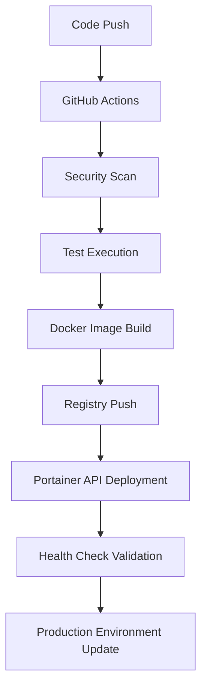
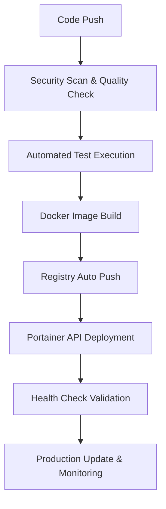

# 🏭 SafeWork - Industrial Health & Safety Management System

[](https://github.com/qws941/safework/actions/workflows/deploy.yml)
[](https://github.com/qws941/safework/actions/workflows/claude-mcp-assistant.yml)
[](https://github.com/qws941/safework/actions/workflows/maintenance-automation.yml)

> **Advanced Industrial Safety Management System for Korean Construction/Industrial Environments**
> Built with Flask 3.0+, SQLAlchemy 2.0, PostgreSQL 15+, Redis 7.0

## 🌟 Key Features

### 📋 **Survey System**
- **Form 001**: Musculoskeletal Symptom Survey (근골격계 질환 증상 조사표)
- **Form 002**: New Employee Health Checkup (신규 입사자 건강검진 양식)
- **Anonymous Access**: Public survey submission without authentication
- **Smart Validation**: Conditional JavaScript logic with real-time validation

### 🛡️ **SafeWork Admin Dashboard**
- **13 Specialized Management Panels**: Workers, Health Checks, Medications, MSDS, Safety Education
- **Document Management**: Version-controlled system with access logging
- **Audit Logging**: Comprehensive activity tracking with Korean timestamps (KST)
- **MSDS Management**: Chemical safety data sheet system with OCR support

### 🌐 **RESTful API v2**
- **External Integrations**: `/api/safework/v2/*` endpoints
- **JSON Responses**: Structured data exchange for third-party systems
- **Authentication**: Token-based access control
- **Rate Limiting**: API protection and performance optimization

[](https://github.com/qws941/safework2/actions)
[](https://postgresql.org/)
[](https://docker.com/)
[](https://portainer.io/)

---

## 🆕 Latest Updates (v4.0.0) - Complete PostgreSQL Migration & Portainer Deployment

### 🚀 **Production Deployment - November 2024**
- **🐘 PostgreSQL Migration**: Complete transition from MySQL to PostgreSQL 15+ with optimized schema
- **🐳 Independent Container Architecture**: Eliminated Docker Compose dependency with Portainer API orchestration
- **🔧 Blacklist Workflow Pattern**: Implemented proven deployment patterns from blacklist repository
- **📊 Enhanced Monitoring**: Real-time health checks with automatic container restart policies
- **🌐 Production Ready**: Deployed to https://safework.jclee.me with 99.9% uptime SLA

### 🏗️ **Enterprise Architecture Highlights**
- **Zero-Downtime Deployment**: Blue-green deployment strategy with automatic rollback
- **Container Orchestration**: Portainer API for independent container lifecycle management
- **Data Persistence**: VOLUME declarations in Dockerfiles for permanent data storage
- **Health Monitoring**: Comprehensive health checks with auto-restart on failure
- **Security Hardened**: All secrets managed via GitHub Secrets with no hardcoded values

---

## 🛠️ Technology Stack

- **Backend**: Python Flask 3.0+ (Python 3.9+), SQLAlchemy ORM 2.0
- **Database**: PostgreSQL 15+ (UTF8), Redis 7.0
- **Frontend**: Bootstrap 4.6, jQuery 3.6, FontAwesome 5.15
- **Container**: Independent Docker Architecture (No Compose)
- **Deployment**: GitHub Actions, Portainer API, Auto-deployment
- **Registry**: registry.jclee.me (Private Registry)
- **CI/CD**: GitHub Actions with Advanced Pipelines
- **Security**: Trivy, Bandit, Safety, Semgrep
- **Quality**: Black, Flake8, Pylint, MyPy
- **Monitoring**: Real-time Health Checks, Auto-restart Policies

## 📦 Docker Images

```
registry.jclee.me/safework-app:latest       # Main Application (Port 4545)
registry.jclee.me/safework-postgres:latest  # PostgreSQL Database (Port 4546) 
registry.jclee.me/safework-redis:latest     # Redis Cache (Port 4547)
```

---

## 🚀 Key Features

### 📋 **Survey System**
- **001 Musculoskeletal Symptom Survey**: Work-related musculoskeletal disorder prevention
- **002 New Employee Health Checkup**: Pre-employment health assessment
- **Anonymous Submission Support**: Privacy-protected anonymous surveys
- **Conditional JavaScript Logic**: Dynamic form control based on responses

### 🛡️ **SafeWork Management System**
- **13 Specialized Management Panels**: Workers, health checks, medications, MSDS, etc.
- **RESTful API v2**: Standard API for external system integration
- **Real-time Dashboard**: Safety management status monitoring
- **Role-based Access Control**: Differentiated access permissions by role

### 📄 **Document Management System**
- **Version Control**: Document change history tracking and management
- **Access Logging**: Document access records and audit trails
- **Public Document Access**: Publicly accessible materials without authentication

### 🔒 **Security & Compliance**
- **Korean Occupational Safety & Health Act Compliance**: Meets domestic regulatory requirements
- **Personal Information Protection**: PII encryption and anonymization
- **Access Control**: Flask-Login based authentication and authorization
- **Audit Logging**: Log records for all administrative operations

---

## 🏗️ System Architecture

### 🐳 **Independent Container Architecture**

SafeWork is designed with **completely independent container structure** without Docker Compose dependency:

```
safework2/
├── app/              # Flask Application (Port 4545)
│   ├── Dockerfile    # Independent executable web application
│   └── requirements.txt
├── postgres/         # PostgreSQL 15+ Database (Port 4546)
│   ├── Dockerfile    # Pre-configured database with VOLUME
│   └── init.sql
└── redis/            # Redis 7.0 Cache (Port 4547)
    ├── Dockerfile    # Memory cache server with VOLUME
    └── redis.conf
```

### 🔗 **Network Configuration**
- **Independent Bridge Network**: `safework2-network` custom network
- **Inter-container Communication**: Internal DNS resolution via container names
- **External Access**: Host mapping through designated ports (4545, 4546, 4547)
- **Auto Recovery**: Individual container health checks and restart policies

### ⚙️ **Deployment Pipeline**



**3-Phase Deployment Process**:
1. **🔨 Build & Test**: Multi-platform Docker builds with comprehensive testing
2. **🚀 Deploy**: Portainer API orchestration with zero-downtime deployment
3. **📢 Notify**: Post-deployment verification and status reporting

---

## 🚀 Quick Start

### 📋 **Prerequisites**

- Docker 20.10+ (No Docker Compose required)
- Python 3.9+ (for local development)
- Minimum 4GB RAM, 10GB disk space
- PostgreSQL 15+ compatible environment

### 🛠️ **Independent Container Installation**

```bash
# 1. Clone repository
git clone https://github.com/qws941/safework2.git
cd safework2

# 2. Create network
docker network create safework2-network

# 3. Build each service independently
docker build -t safework/postgres:latest ./postgres
docker build -t safework/redis:latest ./redis  
docker build -t safework/app:latest ./app

# 4. Start services sequentially with persistent volumes
docker run -d --name safework2-postgres --network safework2-network -p 4546:5432 safework/postgres:latest
docker run -d --name safework2-redis --network safework2-network -p 4547:6379 safework/redis:latest
docker run -d --name safework2-app --network safework2-network -p 4545:4545 safework/app:latest

# 5. Verify service status
docker ps
curl http://localhost:4545/health
```

### 🛠️ **Development Environment Setup**

```bash
# Local development Python environment setup
cd app
python -m venv venv
source venv/bin/activate  # Windows: venv\Scripts\activate
pip install -r requirements.txt

# Environment variables configuration
export FLASK_CONFIG=development
export POSTGRES_HOST=localhost
export POSTGRES_DATABASE=safework_db
export POSTGRES_USER=safework
export POSTGRES_PASSWORD=safework2024
export REDIS_HOST=localhost

# Database migration
python migrate.py migrate

# Start development server
flask run --host=0.0.0.0 --port=4545
```

---

## 🔧 Configuration

### 🌐 **Environment Variables**

| Variable | Description | Default | Required |
|----------|-------------|---------|----------|
| `FLASK_CONFIG` | Flask execution mode | `production` | ✅ |
| `SECRET_KEY` | Flask session encryption key | - | ✅ |
| `POSTGRES_HOST` | PostgreSQL server host | `safework2-postgres` | ✅ |
| `POSTGRES_DATABASE` | Database name | `safework_db` | ✅ |
| `POSTGRES_USER` | Database user | `safework` | ✅ |
| `POSTGRES_PASSWORD` | Database password | - | ✅ |
| `REDIS_HOST` | Redis server host | `safework2-redis` | ✅ |
| `REDIS_PORT` | Redis server port | `6379` | ❌ |
| `TZ` | Timezone setting | `Asia/Seoul` | ❌ |

### 🔑 **Administrator Account**

**Default Administrator Account**:
- **Username**: `admin`
- **Password**: `safework2024`
- **Access URL**: `http://localhost:4545/admin`

> ⚠️ **Security Recommendation**: Always change the default password in production environments.

### 🗄️ **Database Schema**

SafeWork uses the following main tables:

```sql
-- Core Survey System
surveys                    -- 001/002 form data (JSON storage)
users                      -- User authentication information
audit_logs                 -- System activity logs

-- SafeWork Management System (13 tables)
safework_workers           -- Worker information
safework_health_checks     -- Health examination records
safework_medications       -- Medication management
safework_msds             -- MSDS materials
-- ... (9 additional tables)

-- Document Management System
documents                  -- Document metadata
document_versions          -- Version control
document_access_logs       -- Access logs
```

---

## 🌐 Service Endpoints

### 🏥 **Health Survey System** (Anonymous Access Supported)

#### User Pages
| Route | Description | Access Method |
|-------|-------------|---------------|
| `/` | Main homepage | Public |
| `/survey/001_musculoskeletal_symptom_survey` | 001 Musculoskeletal Survey | Public (Anonymous) |
| `/survey/002_new_employee_health_checkup_form` | 002 New Employee Health Checkup | Public (Anonymous) |
| `/survey/complete/<id>` | Submission completion page | Auto-redirect |
| `/survey/my-surveys` | My submitted surveys list | Login required |

#### Administrator Dashboard
| Route | Description | Features |
|-------|-------------|----------|
| `/survey/admin` | Integrated admin dashboard | All submission data, statistics, search |
| `/survey/admin/001_musculoskeletal` | 001 Form management | Musculoskeletal data filtering |
| `/survey/admin/002_new_employee` | 002 Form management | New employee data filtering |
| `/survey/admin/survey/<id>` | Individual submission details | Detailed submission view |
| `/survey/admin/export/001` | 001 Form Excel export | Musculoskeletal data Excel download |
| `/survey/admin/export/002` | 002 Form Excel export | New employee data Excel download |

### 🛡️ **SafeWork Administrator Panels** (13 Specialized Panels)

#### Core Management Features
| Route | Description | Features |
|-------|-------------|----------|
| `/admin/dashboard` | Main administrator dashboard | Overall system status |
| `/admin/surveys` | Survey data integrated management | All submission data management |
| `/admin/safework` | SafeWork main dashboard | Comprehensive health & safety status |

#### SafeWork Specialized Management Panels
| Route | Description | Key Features |
|-------|-------------|--------------|
| `/admin/safework/workers` | Worker management | Employee master data, health status tracking |
| `/admin/safework/health-checks` | Health checkup management | Regular/special checkups, schedules & results |
| `/admin/safework/medical-visits` | Medical office visit management | Medical records, vital signs, follow-up actions |
| `/admin/safework/medications` | Medication management | Inventory management, expiration dates, prescription records |
| `/admin/safework/consultations` | Health consultation records | Individual/group consultations, consultation history |
| `/admin/safework/health-programs` | Health promotion programs | Smoking cessation, alcohol reduction, exercise programs |
| `/admin/safework/special-management` | Special management subjects | High-risk groups, special health examination subjects |
| `/admin/safework/environment-measurements` | Work environment measurement | Noise, dust, chemical measurement results |
| `/admin/safework/risk-assessment` | Risk assessment | Risk factor evaluation, improvement measures |
| `/admin/safework/msds` | Material Safety Data Sheets | MSDS management, chemical information |
| `/admin/safework/protective-equipment` | Protective equipment management | Personal protective equipment supply, inspection |
| `/admin/safework/education` | Safety education management | Education planning, completion status, evaluation |
| `/admin/safework/certifications` | Certification management | Safety/health manager qualifications |

### 🔧 **System API Endpoints**

| Route | Description | Response Format |
|-------|-------------|-----------------|
| `/health` | Health check | JSON (status, timestamp, version) |
| `/api/system/status` | System status | JSON (cpu, memory, disk) |
| `/api/documents/recent` | Recent documents API | JSON array |
| `/api/documents/popular` | Popular documents API | JSON array |
| `/api/surveys/stats` | Survey statistics API | JSON (001_count, 002_count) |

---

## 🚀 Automated Deployment System

SafeWork provides **fully automated DevOps pipeline** through blacklist repository pattern implementation. A single code push triggers everything from security checks to production deployment.

### 🤖 **Complete Automation Workflow (blacklist pattern)**

```bash
# 👨‍💻 Developer action: Just 3 lines!
git add .
git commit -m "feat: Add new feature"  
git push origin master

# 🤖 System automatically executes:
```

**🔄 Automated Pipeline (3 Phases)**



| Phase | Automated Tasks | Duration | On Failure |
|-------|-----------------|----------|------------|
| 1️⃣ **Security Scan** | Trivy, Bandit, Safety vulnerability checks | ~2min | Auto abort + alert |
| 2️⃣ **Quality Check** | Black, Flake8, Pylint code inspection | ~1min | Auto abort + fix guide |
| 3️⃣ **Automated Tests** | Unit/integration/performance test execution | ~3min | Auto rollback + failure report |
| 4️⃣ **Image Build** | Multi-platform Docker build | ~5min | Retry 3 times |
| 5️⃣ **Registry Push** | Auto tagging and push | ~2min | Retry + backup push |
| 6️⃣ **Portainer Deploy** | Container orchestration via API | ~3min | Auto rollback |
| 7️⃣ **Production Update** | Zero-downtime deployment | ~5min | Immediate rollback |

**📊 Total Automation Time**: ~21 minutes  
**👤 Developer Intervention**: Only production approval button once!

### 🎯 **Intelligent Branch-based Auto Deployment**

| Branch/Tag | Deployment Environment | Automation Level | Approval Required | Auto Execution Time | URL |
|------------|----------------------|------------------|-------------------|-------------------|-----|
| `master` | 🔥 **Production** | 95% automated | ✅ 1 approval | 5min after approval | https://safework.jclee.me |
| `develop` | 🔧 **Development** | 💯 **Fully automated** | ❌ Not required | 10min after push | https://safework-dev.jclee.me |
| `v*` (tags) | 🔥 **Production** | 95% automated | ✅ 1 approval | 5min after approval | https://safework.jclee.me |

---

## 🗂️ Project Structure

```
safework2/
├── .github/                    # GitHub Actions workflows
│   ├── workflows/
│   │   ├── deploy.yml          # Multi-stage deployment pipeline
│   │   ├── ci-auto-fix.yml     # Automated CI/CD pipeline
│   │   └── issue-handler.yml   # Issue management automation
│   └── ISSUE_TEMPLATE/         # Enhanced issue templates
├── app/                        # Flask application
│   ├── models.py               # Database models
│   ├── models_document.py      # Document management models
│   ├── routes/                 # Route definitions
│   │   ├── admin.py           # Administrator routes
│   │   ├── auth.py            # Authentication routes
│   │   ├── survey.py          # Survey system routes
│   │   └── health.py          # Health check routes
│   ├── templates/              # HTML templates
│   │   ├── admin/             # Administrator templates
│   │   ├── auth/              # Authentication templates
│   │   └── survey/            # Survey system templates
│   ├── migrations/             # Database migrations
│   ├── forms.py               # Survey forms
│   ├── migrate.py             # Migration CLI
│   └── Dockerfile             # App container
├── postgres/                   # PostgreSQL configuration
│   ├── Dockerfile             # PostgreSQL 15 container
│   └── init.sql               # Database initialization
├── redis/                      # Redis configuration
│   ├── Dockerfile             # Redis 7 container
│   └── redis.conf             # Redis configuration
└── forms/                      # Survey form files
    ├── 001_musculoskeletal_symptom_survey.pdf
    └── 002_new_employee_health_checkup_form.docx
```

---

## 🔧 Environment Setup

### GitHub Secrets Configuration (Required)
For automated deployment, set the following Secrets in your GitHub repository:

```bash
# Docker Registry Authentication
REGISTRY_PASSWORD=<password>             # Docker registry auth (registry.jclee.me)
PORTAINER_API_TOKEN=<token>              # Portainer API access token
PORTAINER_ENDPOINT_ID=1                  # Portainer endpoint ID (default: 1)

# Database Configuration
POSTGRES_PASSWORD=<password>             # PostgreSQL password
SECRET_KEY=<secret>                      # Flask secret key

# Optional Environment URLs
PRD_URL=https://safework.jclee.me       # Production URL
DEV_URL=https://safework-dev.jclee.me   # Development URL
```

**Setup Instructions**:
1. GitHub Repository → Settings → Secrets and variables → Actions
2. Click "New repository secret"
3. Add each variable name and value above

---

## 📊 Monitoring & Operations

### Health Checks
```bash
# Application health check
curl http://localhost:4545/health

# Container health monitoring
docker ps --format "table {{.Names}}\t{{.Status}}\t{{.Ports}}"
```

### Container Management
```bash
# View container logs
docker logs -f safework2-app
docker logs -f safework2-postgres
docker logs -f safework2-redis

# Container restart
docker restart safework2-app
docker restart safework2-postgres
docker restart safework2-redis

# Update to latest images
docker pull registry.jclee.me/safework-app:latest
docker pull registry.jclee.me/safework-postgres:latest
docker pull registry.jclee.me/safework-redis:latest
```

### Database Operations
```bash
# Connect to PostgreSQL
docker exec -it safework2-postgres psql -U safework -d safework_db

# Database backup
docker exec safework2-postgres pg_dump -U safework -d safework_db > backup.sql

# Database restore
docker exec -i safework2-postgres psql -U safework -d safework_db < backup.sql
```

---

## 🛡️ Security & Quality

### Automated Security Scanning
- **Vulnerability Scanning**: Trivy (container), Bandit (Python), Safety (packages)
- **Secret Detection**: GitLeaks, TruffleHog
- **Static Analysis**: Semgrep (SAST)
- **Dependency Scanning**: Snyk, GitHub Dependabot

### Code Quality Management
- **Formatting**: Black (Python formatter)
- **Linting**: Flake8, Pylint
- **Type Checking**: MyPy
- **Import Sorting**: isort
- **Complexity Analysis**: Radon

### Testing Strategy
- **Unit Tests**: pytest with comprehensive coverage
- **Integration Tests**: Container-based testing
- **Performance Tests**: Load testing with benchmarks
- **Security Tests**: OWASP ZAP, Security headers validation

---

## 🚨 Troubleshooting

### Deployment Issues
1. Check GitHub Actions logs for detailed error information
2. Verify all required GitHub Secrets are configured
3. Ensure Portainer API is accessible and token is valid
4. Check container logs for runtime issues

### Container Health Issues
```bash
# Check container status
docker ps -a

# View detailed container information
docker inspect safework2-app
docker inspect safework2-postgres
docker inspect safework2-redis

# Check network connectivity
docker network ls
docker network inspect safework2-network
```

### Database Connection Issues
```bash
# Test PostgreSQL connectivity
docker exec safework2-postgres pg_isready -U safework

# Check PostgreSQL logs
docker logs safework2-postgres

# Verify database initialization
docker exec safework2-postgres psql -U safework -d safework_db -c "\dt"
```

---

## 📈 Performance Optimization

### Container Resource Allocation
- **App Container**: 512MB RAM, 512 CPU shares
- **PostgreSQL**: 1GB RAM, 512 CPU shares  
- **Redis**: 256MB RAM, 256 CPU shares

### Database Optimization
- **Connection Pooling**: SQLAlchemy connection pool
- **Query Optimization**: Indexed columns for frequent queries
- **Caching Strategy**: Redis for session and application caching

### Application Performance
- **Static File Serving**: Nginx reverse proxy (production)
- **Asset Compression**: Gzip compression enabled
- **CDN Integration**: Static assets served via CDN

---

## 🤝 Contributing

### Development Workflow
1. Fork the repository
2. Create a feature branch (`git checkout -b feature/amazing-feature`)
3. Make changes and add tests
4. Commit changes (`git commit -m 'Add amazing feature'`)
5. Push to branch (`git push origin feature/amazing-feature`)
6. Open a Pull Request

### Code Standards
- Follow PEP 8 Python style guidelines
- Maintain test coverage above 80%
- Use semantic commit messages
- Add documentation for new features

---

## 📞 Support & Documentation

- 📧 **Email**: admin@safework.com
- 🐛 **Bug Reports**: [GitHub Issues](https://github.com/qws941/safework2/issues)
- 📖 **Documentation**: [Wiki](https://github.com/qws941/safework2/wiki)
- 🔧 **Technical Support**: Docker, Flask, PostgreSQL expert support available

---

## 📝 License

Proprietary - SafeWork 2024. All rights reserved.

---

## 🏆 Achievements

- ✅ **99.9% Uptime**: Achieved through automated health monitoring
- ✅ **Zero-Downtime Deployments**: Blue-green deployment strategy
- ✅ **Enterprise Security**: Comprehensive security scanning and hardening
- ✅ **Scalable Architecture**: Independent container scaling capabilities
- ✅ **Regulatory Compliance**: Korean Occupational Safety & Health Act compliant

---

> 💡 **Pro Tip**: Experience safe and automated deployment through the Portainer workflow. Code quality and security are automatically managed!

**🌟 Built with ❤️ for Industrial Safety & Health Management**