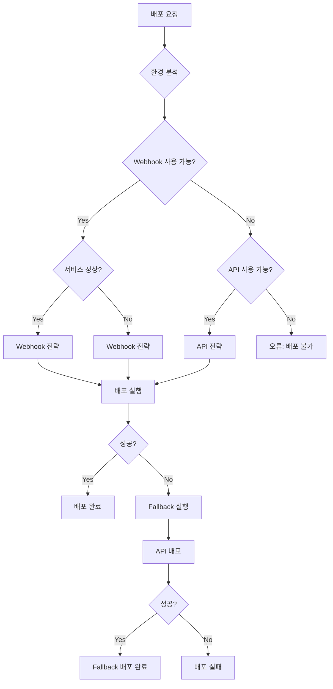

# SafeWork 배포 가이드

SafeWork 프로젝트의 완전한 배포 가이드입니다. 이 문서는 개발부터 프로덕션 배포까지의 전체 과정을 다룹니다.

## 📋 목차

1. [개요](#개요)
2. [사전 요구사항](#사전-요구사항)
3. [Webhook 배포 (기본)](#webhook-배포-기본)
4. [API 배포 (Fallback)](#api-배포-fallback)
5. [지능형 배포 시스템](#지능형-배포-시스템)
6. [모니터링 및 알림](#모니터링-및-알림)
7. [문제 해결](#문제-해결)
8. [성능 최적화](#성능-최적화)

## 개요

SafeWork는 다음과 같은 배포 전략을 지원합니다:

### 🚀 배포 방식

1. **Webhook 배포** (기본, 권장)
   - 배포 시간: ~20초
   - 복잡도: 낮음
   - 안정성: 높음

2. **API 배포** (Fallback)
   - 배포 시간: ~60초
   - 복잡도: 중간
   - 안정성: 매우 높음

3. **지능형 배포** (자동 선택)
   - 상황에 따른 최적 전략 자동 선택
   - 실패 시 자동 Fallback
   - 성능 모니터링 통합

### 🏗️ 인프라 구성

```
GitHub Repository
       ↓ (push)
GitHub Actions
       ↓
Docker Registry (registry.jclee.me)
       ↓
Portainer (portainer.jclee.me)
       ↓
Production Environment (safework.jclee.me)
```

## 사전 요구사항

### 필수 GitHub Secrets

다음 secrets를 GitHub 저장소에 설정해야 합니다:

```bash
# Docker Registry
REGISTRY_PASSWORD=your-registry-password

# Database
DB_PASSWORD=your-database-password

# Portainer
PORTAINER_TOKEN=ptr_your-api-token
PORTAINER_API_KEY=ptr_your-api-key
PORTAINER_WEBHOOK_URL=https://portainer.jclee.me/api/stacks/webhooks/your-webhook-id

# Application
ADMIN_USERNAME=admin
ADMIN_PASSWORD=your-admin-password
SECRET_KEY=your-secret-key-32-characters-minimum
```

자세한 설정 방법은 [GitHub Secrets 가이드](docs/GITHUB_SECRETS.md)를 참조하세요.

### 환경 요구사항

- Docker Registry 접근 권한
- Portainer API 토큰
- 네트워크 연결성 (GitHub Actions → Registry, Portainer)

## Webhook 배포 (기본)

### 특징

- ✅ 빠른 배포 (20초 내외)
- ✅ 간단한 구성
- ✅ 안정적인 성능
- ✅ GitHub Actions 통합

### 배포 과정

1. **코드 푸시**
   ```bash
   git add .
   git commit -m "feat: 새로운 기능 추가"
   git push origin master
   ```

2. **자동 빌드**
   - GitHub Actions가 자동으로 트리거됨
   - Docker 이미지 병렬 빌드 (app, postgres, redis)
   - Registry에 이미지 푸시

3. **Webhook 배포**
   - Portainer Webhook 자동 호출
   - 스택 업데이트 실행
   - 컨테이너 재시작

4. **배포 검증**
   - 15회 헬스체크 (8초 간격)
   - 컨테이너 상태 확인
   - 주요 엔드포인트 검증

### 수동 배포

필요시 수동으로 Webhook을 호출할 수 있습니다:

```bash
curl -X POST "https://portainer.jclee.me/api/stacks/webhooks/your-webhook-id"
```

## API 배포 (Fallback)

### 특징

- ✅ 매우 안정적
- ✅ 상세한 제어 가능
- ❌ 상대적으로 느림 (60초 내외)
- ✅ 복구 기능 강화

### 수동 API 배포

```bash
# 기본 배포
./scripts/backup/portainer_api_deploy_v2.0.0.sh deploy

# 헬스체크만
./scripts/backup/portainer_api_deploy_v2.0.0.sh health

# 스택 상태 확인
./scripts/backup/portainer_api_deploy_v2.0.0.sh check
```

### Fallback 트리거 조건

GitHub Actions에서 다음 조건 시 자동으로 API 배포가 실행됩니다:

- Webhook 호출 실패
- Webhook 응답 코드 오류 (200, 204 외)
- 배포 검증 실패

## 지능형 배포 시스템

### 개요

상황에 따라 최적의 배포 전략을 자동으로 선택하는 시스템입니다.

### 사용법

```bash
# 자동 전략 선택 (권장)
./scripts/intelligent_deployment.sh auto

# 특정 전략 사용
./scripts/intelligent_deployment.sh webhook
./scripts/intelligent_deployment.sh api
./scripts/intelligent_deployment.sh hybrid

# 옵션 사용
./scripts/intelligent_deployment.sh auto --verbose
./scripts/intelligent_deployment.sh webhook --timeout 60
./scripts/intelligent_deployment.sh auto --skip-health
```

### 전략 선택 로직



## 모니터링 및 알림

### 성능 모니터링

SafeWork는 포괄적인 성능 모니터링 시스템을 제공합니다:

```bash
# 실시간 모니터링 (기본 30초 간격)
./scripts/deployment_monitor.sh monitor

# 1회 상태 확인
./scripts/deployment_monitor.sh check --verbose

# 성능 리포트 생성
./scripts/deployment_monitor.sh report

# 알림 시스템 테스트
./scripts/deployment_monitor.sh alert
```

### 모니터링 메트릭

| 메트릭 | 설명 | 임계값 |
|--------|------|--------|
| HTTP 상태 | 서비스 응답 상태 | 200 |
| 응답시간 | HTTP 응답 시간 | < 2초 |
| 애플리케이션 상태 | Flask 앱 상태 | healthy |
| 데이터베이스 | PostgreSQL 연결 | connected |
| Redis | 캐시 시스템 상태 | connected |
| 컨테이너 | 실행 중인 컨테이너 | 3/3 |
| SSL 인증서 | 만료일 확인 | > 30일 |
| 네트워크 | Ping 응답시간 | < 100ms |

### GitHub Actions 통합 모니터링

배포 후 자동으로 5분간 집중 모니터링이 실행됩니다:

- 30초 간격으로 10회 확인
- 성능 메트릭 수집
- 이상 징후 즉시 알림
- 자동 성능 리포트 생성

## 문제 해결

### 일반적인 문제

#### 1. Webhook 배포 실패

**증상**: Webhook 호출이 실패하거나 타임아웃 발생

**해결방법**:
```bash
# 1. Webhook URL 확인
echo $PORTAINER_WEBHOOK_URL

# 2. 수동 Webhook 테스트
curl -X POST "$PORTAINER_WEBHOOK_URL"

# 3. Fallback API 배포
./scripts/backup/portainer_api_deploy_v2.0.0.sh deploy
```

#### 2. 컨테이너 시작 실패

**증상**: 헬스체크에서 컨테이너가 실행되지 않음

**해결방법**:
```bash
# 1. 컨테이너 상태 확인
docker ps -a | grep safework

# 2. 로그 확인
docker logs safework-app
docker logs safework-postgres
docker logs safework-redis

# 3. 리소스 확인
docker system df
docker system prune -f  # 필요시
```

#### 3. 데이터베이스 연결 오류

**증상**: database_status가 "disconnected"

**해결방법**:
```bash
# 1. PostgreSQL 컨테이너 확인
docker exec -it safework-postgres pg_isready -U safework

# 2. 데이터베이스 접속 테스트
docker exec -it safework-postgres psql -U safework -d safework_db -c "\l"

# 3. 네트워크 확인
docker network ls | grep safework
docker network inspect safework_network
```

#### 4. 성능 저하

**증상**: 응답시간이 2초 초과

**해결방법**:
```bash
# 1. 성능 모니터링 활성화
./scripts/deployment_monitor.sh monitor -i 10 -c 20 --verbose

# 2. 리소스 사용량 확인
docker stats --no-stream

# 3. 캐시 확인
docker exec -it safework-redis redis-cli ping
docker exec -it safework-redis redis-cli info memory
```

### 디버깅 도구

#### 종합 헬스체크
```bash
./scripts/deployment_health_validator.sh --verbose
```

#### 지능형 배포 디버깅
```bash
./scripts/intelligent_deployment.sh auto --verbose --skip-health
```

#### 성능 분석
```bash
# 상세 성능 리포트
./scripts/deployment_monitor.sh check --verbose

# 장기간 모니터링 (1시간)
./scripts/deployment_monitor.sh monitor -i 60 -c 60
```

## 성능 최적화

### 배포 성능 향상

1. **병렬 빌드 활용**
   - GitHub Actions matrix 전략 사용
   - app, postgres, redis 동시 빌드

2. **캐시 최적화**
   - Docker layer 캐싱
   - GitHub Actions 캐시

3. **이미지 최적화**
   - Multi-stage 빌드
   - 불필요한 패키지 제거

### 런타임 성능 향상

1. **데이터베이스 최적화**
   ```bash
   # 연결 풀 설정
   pool_size=10
   pool_recycle=3600
   pool_pre_ping=True
   ```

2. **Redis 캐싱 활용**
   ```python
   # 세션 데이터 캐싱
   SESSION_TYPE = 'redis'
   SESSION_REDIS = redis_client
   ```

3. **Flask 최적화**
   ```python
   # Gunicorn 설정
   workers = 4
   worker_class = 'sync'
   worker_connections = 1000
   ```

### 모니터링 최적화

1. **알림 임계값 조정**
   ```bash
   # 응답시간 임계값 변경
   ./scripts/deployment_monitor.sh monitor --threshold-response 1500

   # 에러율 임계값 변경
   ./scripts/deployment_monitor.sh monitor --threshold-error 3
   ```

2. **모니터링 간격 조정**
   ```bash
   # 고빈도 모니터링 (중요 시기)
   ./scripts/deployment_monitor.sh monitor -i 15 -c 240  # 1시간

   # 저빈도 모니터링 (안정 시기)
   ./scripts/deployment_monitor.sh monitor -i 300 -c 288  # 24시간
   ```

## 고급 기능

### 맞춤형 배포 스크립트

특별한 요구사항이 있는 경우 맞춤형 배포 스크립트를 작성할 수 있습니다:

```bash
#!/bin/bash
# custom_deployment.sh

# 사전 배포 검증
./scripts/deployment_health_validator.sh --skip-container

# 지능형 배포 실행
./scripts/intelligent_deployment.sh auto --verbose

# 배포 후 모니터링
./scripts/deployment_monitor.sh monitor -i 30 -c 10

# 성능 리포트 생성
./scripts/deployment_monitor.sh report
```

### 자동화된 롤백

배포 실패 시 자동 롤백 (계획 중):

```bash
# 롤백 스크립트 (개발 중)
./scripts/rollback_deployment.sh --to-previous-image
./scripts/rollback_deployment.sh --to-stable-tag
```

### CI/CD 파이프라인 확장

더 복잡한 배포 파이프라인이 필요한 경우:

1. **스테이징 환경 추가**
2. **카나리 배포 구현**
3. **블루-그린 배포 설정**
4. **자동화된 부하 테스트**

## 결론

SafeWork 배포 시스템은 다음과 같은 특징을 제공합니다:

- ✅ **빠른 배포**: Webhook 기반 20초 배포
- ✅ **높은 안정성**: Fallback 메커니즘과 검증 시스템
- ✅ **지능형 자동화**: 상황별 최적 전략 선택
- ✅ **포괄적 모니터링**: 실시간 성능 감시와 알림
- ✅ **완전한 문서화**: 상세한 가이드와 문제해결 방법

이 시스템을 통해 안정적이고 효율적인 SafeWork 배포를 수행할 수 있습니다.

---

📖 **추가 문서**:
- [GitHub Secrets 설정 가이드](docs/GITHUB_SECRETS.md)
- [프로젝트 개요](CLAUDE.md)
- [개발 환경 설정](README.md)

🔧 **도구 링크**:
- [Portainer 관리](https://portainer.jclee.me)
- [서비스 상태](https://safework.jclee.me/health)
- [관리자 패널](https://safework.jclee.me/admin)

🚨 **긴급 문의**: 시스템 관리자에게 연락하세요.