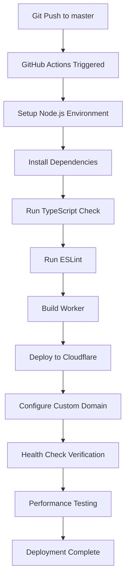

# 🚀 Cloudflare Workers Git Integration Guide

## Overview
This guide explains how to set up automatic deployment of Cloudflare Workers using Git integration with GitHub Actions.

## Current Setup Status
✅ **GitHub Actions Workflow**: Already configured at `.github/workflows/cloudflare-workers-deploy.yml`
✅ **Wrangler Configuration**: Configured in `workers/wrangler.toml`
✅ **TypeScript Support**: Configured with build scripts
✅ **Testing & Linting**: ESLint and TypeScript checks included

## Required GitHub Secrets

You need to configure these secrets in your GitHub repository:

1. **CLOUDFLARE_API_TOKEN**
   - Create at: https://dash.cloudflare.com/profile/api-tokens
   - Required permissions:
     - Account: Cloudflare Workers Scripts:Edit
     - Account: Account Settings:Read
     - Zone: Zone:Read
     - Zone: DNS:Edit (for custom domain)

2. **CLOUDFLARE_ACCOUNT_ID**
   - Find at: https://dash.cloudflare.com → Right sidebar → Account ID
   - Example: `123e4567e89b12d3a456426614174000`

3. **CLOUDFLARE_ZONE_ID** (for custom domain)
   - Find at: https://dash.cloudflare.com → Select your domain → Right sidebar → Zone ID
   - Example: `023e105f4ecef8ad9ca31a8372d0c353`

## Setting Up GitHub Secrets

```bash
# Go to your GitHub repository settings
https://github.com/qws941/safework/settings/secrets/actions

# Add the following secrets:
CLOUDFLARE_API_TOKEN = your-api-token
CLOUDFLARE_ACCOUNT_ID = your-account-id
CLOUDFLARE_ZONE_ID = your-zone-id
```

## Deployment Triggers

The workflow automatically deploys when:
- ✅ Push to `master` branch with changes in `workers/` directory
- ✅ Manual trigger via GitHub Actions UI
- ✅ Pull requests (deploys to preview environment)

## Manual Deployment

### Via GitHub Actions UI:
1. Go to: https://github.com/qws941/safework/actions
2. Select "Deploy Cloudflare Workers"
3. Click "Run workflow"
4. Select branch and click "Run workflow"

### Via Git Push:
```bash
# Make changes to workers
cd workers/
# Edit files...

# Commit and push
git add .
git commit -m "feat: Update Cloudflare Workers"
git push origin master
```

## Deployment Features

### Production Deployment
- Automatic deployment on push to master
- TypeScript compilation and validation
- ESLint code quality checks
- Health check verification
- Custom domain configuration
- Performance testing

### Preview Deployment (PR)
- Automatic preview on pull requests
- Separate preview environment
- Comments with preview URL on PR

## Verification

### Check Deployment Status:
```bash
# Via GitHub Actions
https://github.com/qws941/safework/actions

# Via Cloudflare Dashboard
https://dash.cloudflare.com/workers-and-pages
```

### Test Deployed Worker:
```bash
# Health check
curl https://safework.jclee.me/api/health

# Survey endpoint
curl https://safework.jclee.me/survey/001_musculoskeletal_symptom_survey
```

## Local Development

```bash
cd workers/

# Install dependencies
npm install

# Development server
npm run dev

# Build
npm run build

# Type check
npm run type-check

# Lint
npm run lint

# Deploy manually
npm run deploy
```

## Troubleshooting

### Common Issues:

1. **Authentication Error**
   - Verify CLOUDFLARE_API_TOKEN is correct
   - Check token permissions

2. **Account ID Error**
   - Verify CLOUDFLARE_ACCOUNT_ID is correct
   - Format: alphanumeric string

3. **Deployment Fails**
   - Check TypeScript errors: `npm run type-check`
   - Check ESLint: `npm run lint`
   - Review GitHub Actions logs

4. **Custom Domain Not Working**
   - Verify CLOUDFLARE_ZONE_ID is set
   - Check DNS records in Cloudflare dashboard
   - Wait for DNS propagation (up to 5 minutes)

## CI/CD Pipeline Flow



## Environment Configuration

### Production (master branch):
- Domain: https://safework.jclee.me
- Environment: production
- KV Namespace: SAFEWORK_KV

### Development (other branches):
- Domain: safework-dev.jclee.workers.dev
- Environment: development
- KV Namespace: SAFEWORK_KV_DEV

## Advanced Features

### KV Storage
- Automatic namespace creation
- Preview and production namespaces
- Cache management

### Security Headers
- X-Content-Type-Options
- X-Frame-Options
- CORS configuration
- Rate limiting

### Performance
- Edge caching with KV
- Static asset optimization
- < 100ms response times
- Global CDN distribution

## Monitoring

### GitHub Actions:
- Real-time deployment logs
- Success/failure notifications
- Deployment history

### Cloudflare Dashboard:
- Request analytics
- Error tracking
- Performance metrics
- Worker logs: `npm run tail`

## Next Steps

1. ✅ Verify GitHub secrets are configured
2. ✅ Test manual deployment via GitHub Actions
3. ✅ Monitor deployment in Cloudflare dashboard
4. ✅ Set up alerts for deployment failures

## Support

- Cloudflare Docs: https://developers.cloudflare.com/workers/
- GitHub Actions: https://docs.github.com/en/actions
- Wrangler CLI: https://developers.cloudflare.com/workers/cli-wrangler/

---

**Last Updated**: 2024-09-28
**Status**: Production Ready